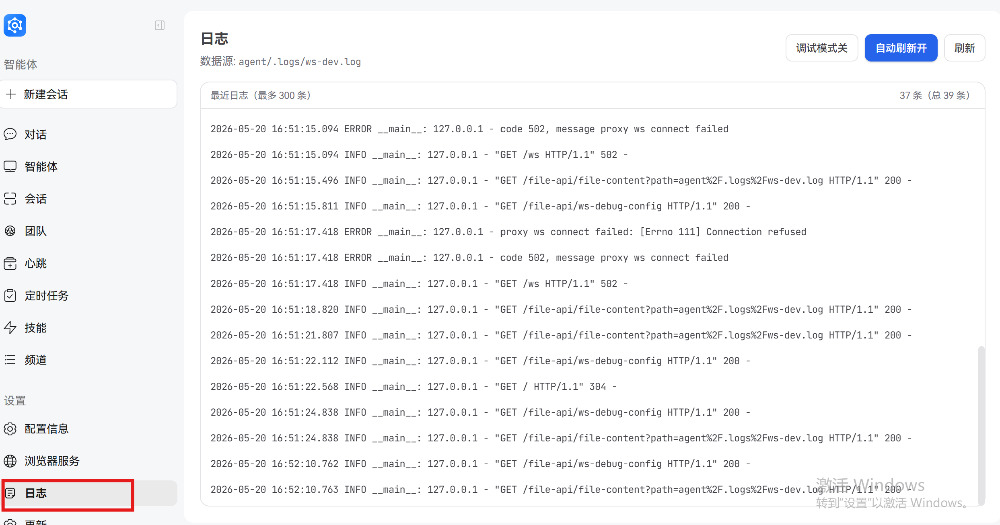

# Logging System

JiuwenSwarm provides a comprehensive logging system to record system operation status, debugging information, and audit logs, helping users monitor system operation, troubleshoot issues, and analyze system behavior.

## 1. Logging Basics

### 1.1 Storage Location

By default, JiuwenSwarm log files are stored in the following location:

```
~/.jiuwenswarm/agent/.logs/
```

### 1.2 Log File Classification

The logging system categorizes logs by component type and stores them in different files:

| Log File | Content |
|---------|---------|
| `gateway.log` | Gateway-related logs, including modules under `app`, `gateway`, `evolution`, `utils`, etc. |
| `channel.log` | Channel-related logs, including all modules under `channels` |
| `agent_server.log` | Agent server logs, including modules under `agents` and `.server` |
| `full.log` | Aggregation of all component logs |
| `desktop.log` | Desktop application logs |
| `permissions.log` | Permission-related logs |
| `ws-dev.log` | Web service development mode logs |

### 1.3 Log Content Types

The logging system has two main content types:

#### 1.3.1 General Logs

General logs are categorized by component and record system operation status, error messages, debugging information, etc.:
- Implemented using the standard Python logging module
- Stored in different files based on component types (see Section 1.2)

#### 1.3.2 Audit Logs

Audit logs record sandbox operation details in structured JSONL format, including:
- Command execution (`exec_command`)
- File transfer (`file_transfer`)
- Network requests (`network_request`)

Each audit log contains operation type, parameters, results, execution time, etc.

For sandbox operation audit logs, the storage location can be specified through configuration:
- Default: Not set (audit logs are not persisted)
- Can be specified via `--save-logs DIR` parameter or `JIUWENBOX_SAVE_LOGS_DIR` environment variable
- File name format: `{sandbox_id}-{YYYYMMDDTHHMMSS}.audit.log`

## 2. Viewing Logs

### 2.1 Frontend Log Viewing



### 2.2 Real-time Log Viewing

Use the `tail` command to view logs in real-time:

```bash
# View full logs
tail -f ~/.jiuwenswarm/agent/.logs/full.log

# View specific component logs
tail -f ~/.jiuwenswarm/agent/.logs/gateway.log
```

### 2.3 Viewing Historical Logs

Use `cat` to view logs:

```bash
# View complete log file
cat ~/.jiuwenswarm/agent/.logs/full.log
```

### 2.4 Log Searching

Use the `grep` command to search log content:

```bash
# Search logs containing "error"
grep -i "error" ~/.jiuwenswarm/agent/.logs/full.log

# Search logs for a specific time range
grep "2026-05-19 15:" ~/.jiuwenswarm/agent/.logs/full.log
```

### 2.5 Viewing Audit Logs

```bash
# View audit logs
cat /var/log/jiuwenbox/9284a4bf-870-20260515T112345.audit.log

# View audit logs with jq formatting
jq '.' /var/log/jiuwenbox/9284a4bf-870-20260515T112345.audit.log
```

## 3. Log Rotation Strategy

The logging system adopts the following rotation strategy:

- **Size Limit**: Default maximum 20MB per log file (hardcoded constant, not configurable via config.yaml)
- **Retention Count**: Default 20 log files retained (hardcoded constant, not configurable via config.yaml)
- **Automatic Rotation**: When a log file reaches the size limit, a new file is automatically created and old files are archived
- **Naming Format**: Archived files are named `{filename}_{YYYYMMDD_HHMMSS}.log`, e.g., `gateway_20260519_153045.log`

> **Note**: To modify rotation parameters (max_bytes, backup_count), you need to modify the source code constants in `jiuwenswarm/common/utils.py` at lines 47-48.

## 4. Log System Architecture

### 4.1 Core Modules

- **Log Configuration**: `setup_logger` function in `jiuwenswarm/common/utils.py`
- **Audit Logs**: `jiuwenbox/src/jiuwenbox/server/audit_logger.py`
- **Default Log Implementation**: `openjiuwen/core/common/logging/default/default_impl.py`

### 4.2 Log Flow

1. Each module obtains a logger through `logging.getLogger(__name__)`
2. Automatically classified into different components based on logger name
3. Logs are output to both console and corresponding component log files
4. All logs are aggregated into `full.log`
5. Automatic rotation when log files reach size limit

## 5. Log Configuration

### 5.1 Configuration File

Log levels are configured through the `logging` section in the `config.yaml` file:

```yaml
logging:
  level: INFO            # Default log level (DEBUG/INFO/WARNING/ERROR/CRITICAL)
  console_level: INFO    # Console log level
  gateway: INFO          # Gateway component log level
  channel: INFO          # Channel component log level
  agent_server: INFO     # Agent server log level
  full: INFO             # Full log level
```

> **Note**: Log rotation parameters (max_bytes, backup_count) are hardcoded constants and cannot be configured via config.yaml. To adjust them, modify the source code in `jiuwenswarm/common/utils.py` at lines 47-48.

### 5.2 Environment Variables

The console log level can be overridden through environment variables:

```bash
LOG_LEVEL=DEBUG jiuwenswarm-start
```

> **Note**: After modifying log configuration, you need to restart the service for changes to take effect.

## 6. Log Levels

JiuwenSwarm supports standard Python logging levels:

| Level | Description |
|------|------|
| DEBUG | Debug information, used for development and debugging |
| INFO | General information, recording normal system operation status |
| WARNING | Warning information, recording potential issues |
| ERROR | Error information, recording system errors |
| CRITICAL | Critical error information, recording system crashes and other serious issues |

## 7. Log Format

The log format includes timestamp, log level, module name, and log message:

```
2026-05-19 15:30:45.123 INFO jiuwenclaw.app: Service started successfully
```

### 7.1 Audit Log Format

Audit logs use structured JSON format:

```json
{
  "timestamp": "2026-05-19T15:30:45.123Z",
  "event_type": "exec_command",
  "sandbox_id": "9284a4bf-870",
  "command": "ls -la",
  "workdir": "/home/user",
  "ok": true,
  "exit_code": 0,
  "stdout": "total 40\ndrwxr-xr-x  5 user user 4096 May 19 15:30 .",
  "stderr": "",
  "duration_ms": 123
}
```

## 8. Common Issues and Troubleshooting

### 8.1 Large Log Files

**Problem**: Log files grow too quickly and occupy too much disk space

**Solution**:
- Lower log level to reduce log output (modify `logging.level` in config.yaml)
- Periodically clean up archived log files (manual cleanup or scheduled tasks)
- To adjust rotation parameters, modify the hardcoded constants in `jiuwenswarm/common/utils.py` at lines 47-48:
  ```python
  _LOG_FILE_MAX_BYTES = 20 * 1024 * 1024  # Modify this to change single file size
  _LOG_FILE_BACKUP_COUNT = 20             # Modify this to change the number of archives
  ```

### 8.2 No Log Output

**Problem**: Cannot find log files or log content is empty

**Solution**:
- Check if log directory permissions are correct
- Check if log level configuration is too high
- Check if the service is started normally

### 8.3 Log Garbled Characters

**Problem**: Log files contain garbled characters

**Solution**:
- Ensure system encoding is set correctly (UTF-8 recommended)
- Use text editors that support UTF-8 encoding to view logs

## 9. Best Practices

1. **Development Environment**: Use DEBUG level to obtain detailed debugging information
2. **Production Environment**: Use INFO or WARNING level to reduce log output
3. **Regular Cleaning**: Regularly clean expired log files to avoid occupying too much disk space
4. **Centralized Management**: Consider using log collection tools (such as ELK Stack) for centralized log management
5. **Sensitive Information**: Be careful with sensitive information that may be included in logs, such as API keys, passwords, etc.

## 10. Related Configuration Files

- Main configuration file: `~/.jiuwenswarm/config/config.yaml`
- Environment variable file: `~/.jiuwenswarm/config/.env`
- Log system implementation: `jiuwenclaw/common/utils.py`
- Audit log implementation: `jiuwenbox/src/jiuwenbox/server/audit_logger.py`