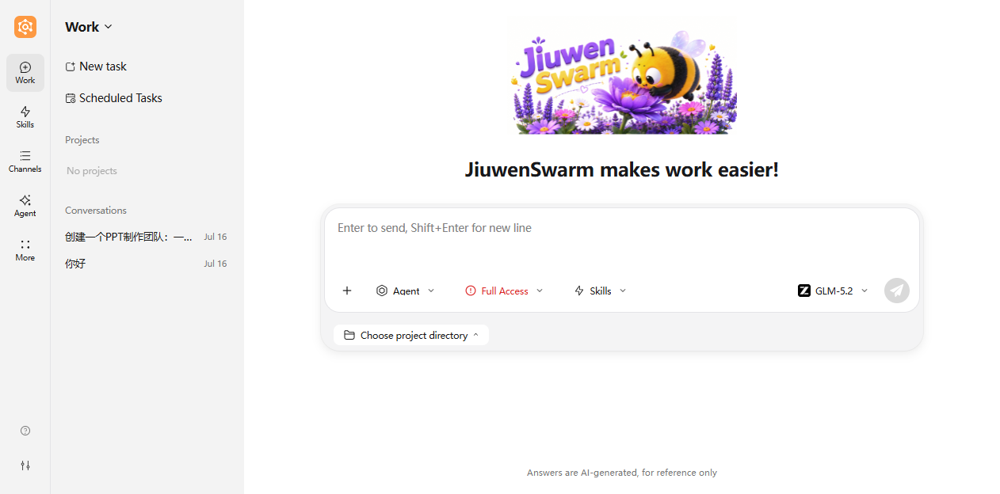
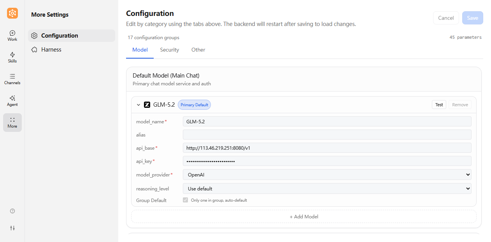
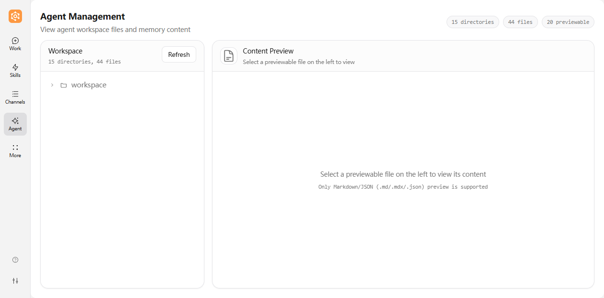

# JiuwenSwarm page overview (web)

> **Goal:** Help you understand the web UI structure, where features live, and how to interact with them. This is a foundation for deeper use.
>
> **Simplified Chinese:** [页面概览](../zh/页面概览.md)

---

## Overall layout

The JiuwenSwarm web app uses a two-column layout: an icon-based navigation bar on the left and the main workspace on the right. The design is clean and efficient.

### Layout at a glance

| Area | Position | Main purpose |
|------|----------|--------------|
| Left navigation | Left edge | Icon-based feature menu, new conversation, settings |
| Main workspace | Center and right | Chat, task execution, feature management |

### Layout notes

1. **Icon navigation:** The left side uses compact icon-based navigation to save space.
2. **Centralized information:** Core interaction features and auxiliary information are both in the main workspace.
3. **Responsive design:** The page adjusts automatically based on screen width.

> **Tip:** A wide display (e.g. 1920×1080 or higher) works best.

---

## Left navigation

The left navigation bar is the main entry point for JiuwenSwarm features, using an icon-based design with three areas: **main navigation**, **more menu**, and **bottom buttons**.

### Main navigation

These items are always visible in the navigation bar:

| Item | What it is | When to use it |
|------|------------|----------------|
| **Work** | Main entry for chat and task execution, including session management, scheduled tasks, and project management | Daily Q&A, task execution, code generation, etc. |
| **Skills** | Skills library: browse, install, configure extensions | Extra capabilities (e.g. deep search, PPT) |
| **Channels** | Outbound channels: Feishu, WeChat, Telegram, etc. | Push AI messages to other apps |
| **Agent** | View agent workspace files and memory content | When you need to inspect agent files or memory |

### More menu

Click the **More** button to expand additional settings:

| Item | What it is | When to use it |
|------|------------|----------------|
| **Configuration** | System and model settings | Change behavior or switch models |
| **Harness** | Harness Package management: select Agent runtime mode, import/export extension packages | Switching native/extended mode, customizing Agent capabilities |

### Bottom buttons

- **Setup guide**: Step-by-step configuration wizard
- **More Settings**: Additional settings and preferences

### Version info

Version information is available in the **More Settings** panel at the bottom of the navigation bar.

> **Note:** Some advanced features need the right permissions or config.

---

## Main workspace (center)

This is where most interaction happens.

### 1. Chat view

The primary surface for talking to JiuwenSwarm.

**Input**

- Type in the text box and send (e.g. Enter, depending on settings).

**What you see**

- Conversation history: full thread of messages
- **AI reply:** final answer and intermediate steps when shown
- **Tool calls:** tools the agent used and their results

### 2. Execution modes

JiuwenSwarm offers two execution modes. Pick the one that fits the task.

> **Scope of this page:** only switching modes **in the app**. It does not cover changing config files or environment variables; for that, see [Configuration](Configuration.md).

| Mode (UI) | How it works | When to use it |
|------|------------|----------------|
| **Agent mode** | Single agent handles the task with full tool access | Most tasks, when you need a single agent to work autonomously |
| **Cluster mode** | Multi-agent: a leader coordinates specialists; subtasks in parallel; leader merges the output | Large jobs (e.g. PPT, deep research) that need many roles |

**Switching modes**

- Choose the mode in the **input area** of the main chat using the mode dropdown.
- Modes change how the agent plans and runs; in **Cluster mode** you can usually see how work is split and parallel work (as the UI shows).

### 3. Task control bar

While a task is **running**, you can often **manually** control the current run in the same area:

| State | Meaning | What you can do (typical) |
|------|---------|----------------------------|
| **Running** | The model is replying to your input | Wait; you can click **Stop** to terminate the current execution |
| **Stopped** | Stopped; the same user instruction will not continue | You can send a new input |

> 💡 **Tip**: In Cluster mode, clicking Stop pauses the current execution and you can resume it.

### 4. Input area controls

The input area at the bottom of the chat page provides several controls:

| Control | What it does |
|---------|--------------|
| **Add image** | Attach an image to your message |
| **Agent/Cluster** | Switch execution mode |
| **Full Access/Default** | Switch permission level for tool access |
| **Skills** | Select skills to use for this conversation |
| **Model** | Switch the AI model (e.g. GLM-5.2) |

---

## FAQ

**Q: The page feels slow?**  
A: Check your network, clear cache for the site, or try refreshing the page.

**Q: Connection shows “disconnected”?**  
A: Check that the backend is running and your network is OK.

---

> **Next steps:** [Quick start](Quickstart.md) and [Skills](Skills.md) for more detail (Chinese: [快速开始](../zh/Quickstart.md), [技能](../zh/技能.md)).
