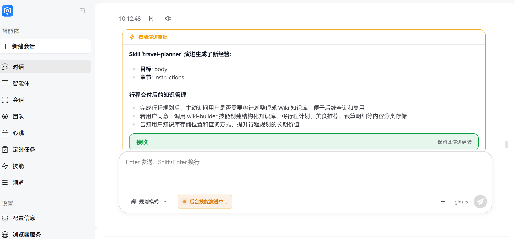

# Skill Self-Evolution

## 1. Concept Explanation

### 1.1 Introduction to Skill Self-Evolution

Skill self-evolution is a core feature of JiuwenSwarm based on the openJiuwen evolution framework. It breaks the limitation of fixed capabilities in traditional Agent systems. In traditional systems, once capability definitions are written, they rarely change—tool call errors only generate log entries, and user feedback about misunderstandings doesn't alter future behavior. The capability ceiling is fixed from the day of deployment.

JiuwenSwarm's skill self-evolution mechanism uses a built-in evolution signal detection system to continuously monitor execution processes and dialogue content, automatically converting real-world usage issues into improvement inputs for skills. This transforms skills from one-time static documents into living documents that continuously iterate with real usage.

### 1.2 Core Value

The core value of the skill self-evolution mechanism lies in:

- **Lower day-to-day intervention cost**: The agent identifies reusable experience automatically and saves it according to the approval policy
- **Continuous capability improvement**: Skills become more accurate and reliable with increased usage time
- **Adaptive to scene changes**: Automatically adjusts and optimizes based on actual usage scenarios
- **Reduced maintenance costs**: Decreases manual effort for updating and maintaining skills

## 2. Usage Methods

### 2.1 Self-Evolution Configuration Switch

Automatic Skill learning is enabled with `react.evolution.skill_evolution`, which defaults to `false`. The Web and TUI configuration pages expose only this switch. When enabled, the system can extract experience automatically, suggest creating Skills, and provide the `/evolve` commands and evolution tools.

Turning the switch off disables both automatic learning and manual evolution capabilities, but does not prevent explicit use of the general `skill-creator` or `swarmskill-creator` capabilities. Configurations that previously used `enabled`, `auto_scan`, `skill_create`, or the related environment variables do not automatically enable the new switch and must be migrated explicitly.

The minimum configuration is:

```yaml
react:
  evolution:
    skill_evolution: true
    auto_save: false
```

`auto_save` is an advanced YAML-only approval option. With `false`, regular evolution results for a Single Agent or Team leader require approval. With `true`, regular evolution results can be saved automatically. Teammates use a fixed automatic-approval policy.


### 2.2 Automatic Evolution

The system automatically detects evolution signals after each complete conversation ends (in the after_invoke phase). When execution exceptions or user corrections are detected, it generates evolution records.

The system identifies evolution signals and generates candidate experience automatically. Whether user confirmation is required depends on the role and the `auto_save` setting. After experience is saved, it is loaded automatically the next time the Skill is used.


### 2.3 Manual Evolution Triggering

If you want to immediately trigger evolution for a specific skill, you can enter:

```bash
/evolve <skill_name>
```

For example:

```bash
/evolve xlsx
```

The system scans recent dialogue and execution records, generates evolution experience for the skill, and displays the generated results.



### 2.4 View Evolution Status

To see which skills have pending evolution experience, you can enter:

```bash
/evolve list
```

The system lists all skills containing pending evolution records and their specific content summaries.


### 2.5 Manage Evolution Experience

Evolution experience is stored in the `evolutions.json` file under the skill directory. **Note**: This file is dynamically generated when evolution is first triggered and may not exist if no evolution has occurred. You can edit this file directly to manage evolution experience:

**Directory location:**
```
~/.jiuwenswarm/agent/workspace/skills/<skill_name>/
├── SKILL.md           # Skill source document
├── evolutions.json    # Evolution experience records (dynamically generated)
└── ...
```

**Common operations:**
- Add new records: Append new objects to the `entries` array
- Modify records: Edit the `change.content` field to update evolution content
- Delete records: Remove from the array
- Mark as solidified: Set `applied` to `true` (system will also toggle this during solidification)

⚠️ **Important**: Do not modify system-managed fields such as `id`, `source`, `timestamp`, `context`, `section`, `action`, `target`, or `relevant`. These fields are generated and maintained by the system.

**Before editing**, consider backing up the file. After editing, the changes take effect automatically in the next conversation.

## 3. Case Practice: Triggering Code Modifications Through Text Dialogue Fields

### 3.1 Scenario Background

Suppose we have a simple `file-operations` skill for handling file operations. This skill includes a `read_file` function for reading file content.

**Initial SKILL.md definition:**
```markdown
# file-operations Skill

## Functions

### read_file
- Function: Read the content of the specified file
- Parameters:
  - `file_path`: File path
- Return: File content

## Examples
- Read file: read_file({"file_path": "/path/to/file.txt"})
```

### 3.2 Evolution Triggered by Dialogue

#### Round 1: Problem Discovery

```
User: Help me read the test.txt file in the current directory
Assistant: Sure, I'll read the test.txt file in the current directory for you.
Tool: file-operations.read_file({
  "file_path": "test.txt"
})
Tool Response: Error: File not found: test.txt
Assistant: Sorry, I can't find the test.txt file. Could you provide the full path?
```

The system detects tool execution failure (`File not found`) and automatically triggers an evolution signal.

#### Round 2: User Provides Full Path

```
User: It should be ./test.txt
Assistant: Sure, I'll read the ./test.txt file for you.
Tool: file-operations.read_file({
  "file_path": "./test.txt"
})
Tool Response: This is the content of the test.txt file.
Assistant: Successfully read the ./test.txt file. Here's the content:
This is the content of the test.txt file.
```

#### Round 3: User Feedback

```
User: No, when I just provide the file name, you should automatically look in the current directory without me manually adding ./
Assistant: Thank you for your feedback. I'll optimize this feature so it automatically looks in the current directory when only a file name is provided.
```

The system detects user correction feedback ("No") and triggers another evolution signal.

### 3.3 Automatically Generated Evolution Records

The system automatically generates evolution records in the `evolutions.json` file under the `file-operations` skill directory.

### 3.4 Effect After Evolution

When the skill is called again, it automatically loads the evolution experience, and the improved functionality works as follows:

```
User: Help me read the test.txt file in the current directory
Assistant: Sure, I'll read the test.txt file in the current directory for you.
Tool: file-operations.read_file({
  "file_path": "test.txt"
})
Tool Response: This is the content of the test.txt file.
Assistant: Successfully read the test.txt file. Here's the content:
This is the content of the test.txt file.
```

Now, when the user only provides a file name, the system automatically looks in the current directory without requiring the user to manually add the `./` prefix.

## 4. Feature Interpretation: Principles and Mechanisms

### 4.1 Core Components

#### 4.1.1 SkillCallOperator

SkillCallOperator is the core entry point for interaction between JiuwenSwarm and skills, responsible for unified management of skills:

- Reads skill definitions (SKILL.md)
- Executes skill commands
- Automatically loads accumulated evolution experiences of skills

When the system detects areas for improvement, these improvements are first stored in `evolutions.json`, and SkillCallOperator merges them before returning them to the Agent.

#### 4.1.2 SkillExperienceOptimizer

SkillExperienceOptimizer is the optimizer that drives the entire skill evolution process:

1. **Receive signals**: Receives exception signals from SignalDetector to understand what problems the current skill is encountering
2. **Analyze and judge**: Combines dialogue context to determine if the problem is worth recording
3. **Generate improvements**: Calls LLM to generate specific improvement suggestions
4. **Execute recording**: Writes generated improvement plans to evolution records

When you use the `/evolve` command, it's SkillExperienceOptimizer working behind the scenes.

#### 4.1.3 SkillEvolutionRail

SkillEvolutionRail is the core manager of the evolution lifecycle, responsible for coordinating various stages of evolution work:

- **Signal scanning**: Calls SignalDetector to extract events that require evolution
- **Record generation**: Calls LLM to convert signals into executable improvement plans
- **Storage management**: Maintains reading and writing of `evolutions.json` files
- **Content solidification**: Merges pending evolution records into the original SKILL.md

It connects SignalDetector, SkillExperienceOptimizer, and SkillCallOperator to form a complete evolution loop.

#### 4.1.4 SignalDetector

SignalDetector is the detector for evolution signals, continuously monitoring for anomalies in dialogue and execution results:

- Listens to every tool execution result, capturing error keywords
- Captures user correction feedback (such as "no", "should be", etc.)
- Determines which skill the signal should be attributed to and associates context

SignalDetector works based on rules, does not require calling LLM, and therefore has fast response speed.

### 4.2 Signal Detection Mechanism

#### 4.2.1 Execution Exception Detection

The system automatically detects exceptions in tool execution, including:
- Tool call timeouts
- Interface return errors
- Exception interruptions during code execution

Detection keywords include but are not limited to:
- General errors: `error`, `exception`, `failed`, `failure`, `timeout`
- Network-related: `connection error`, `econnrefused`, `enoent`
- Permission-related: `permission denied`, `command not found`

#### 4.2.2 User Correction Detection

The system identifies user correction feedback, which is often more valuable than error logs:

- Chinese patterns: `不对`, `不是这`, `错 了`, `应该 是`, `你搞错了`, `纠正一下`
- English patterns: `that's wrong`, `you're wrong`, `should be`, `actually`

### 4.3 Evolution Process

```text
User chat / tool run
        │
        ▼
┌───────────────────┐
│  SignalDetector   │  Listens and identifies signals
│   Detects execution exceptions │
│   Detects user corrections │
└────────┬──────────┘
         │
         ▼
┌─────────────────────────────┐
│    SkillEvolutionRail    │
│     run_evolution()        │  Extracts evolution signals
└────────────┬───────────────┘
             │
             ▼
┌─────────────────────────────┐
│    SkillEvolutionRail    │
│ generate_and_emit_experience() │  LLM generates evolution records
└────────────┬───────────────┘
             │
             ▼
┌─────────────────────────────┐
│      evolutions.json        │  Writes pending solidification records
│    (Under Skill directory) │
└────────────┬───────────────┘
             │
             ▼ (via /evolve rebuild or auto-load)
┌─────────────────────────────┐
│      rewrite_skill()         │  Merges into SKILL.md
└─────────────────────────────┘
```

### 4.4 Evolution Record Storage

Evolution records are stored in the `evolutions.json` file under each skill directory:

```json
{
  "skill_id": "<skill_name>",
  "version": "1.0.0",
  "updated_at": "2024-01-15T10:30:00Z",
  "entries": [
    {
      "id": "ev_1234abcd",
      "source": "execution_failure",
      "timestamp": "2024-01-15T10:30:00Z",
      "context": "API timeout after 30s",
      "change": {
        "section": "Troubleshooting",
        "action": "append",
        "content": "## FAQ\n- On API timeout..."
      },
      "applied": false
    }
  ]
}
```

Where:
- `applied: false` indicates pending solidification status
- `applied: true` indicates already solidified into SKILL.md
