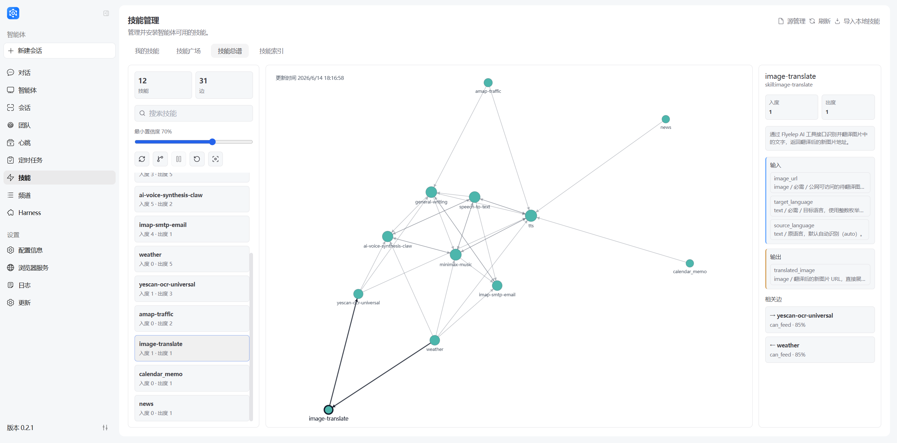
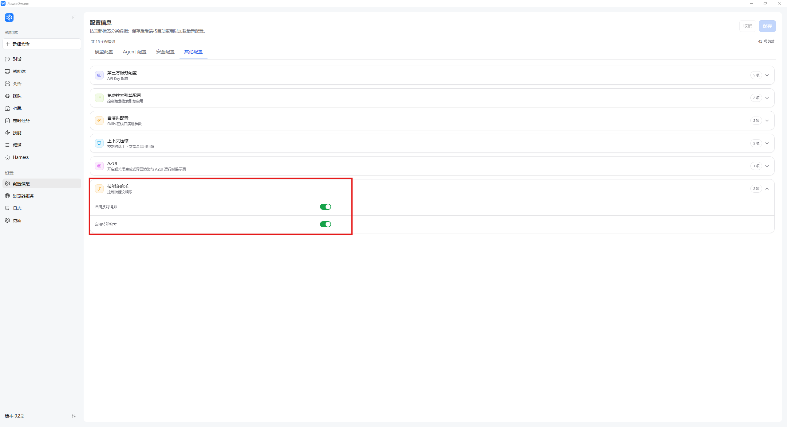
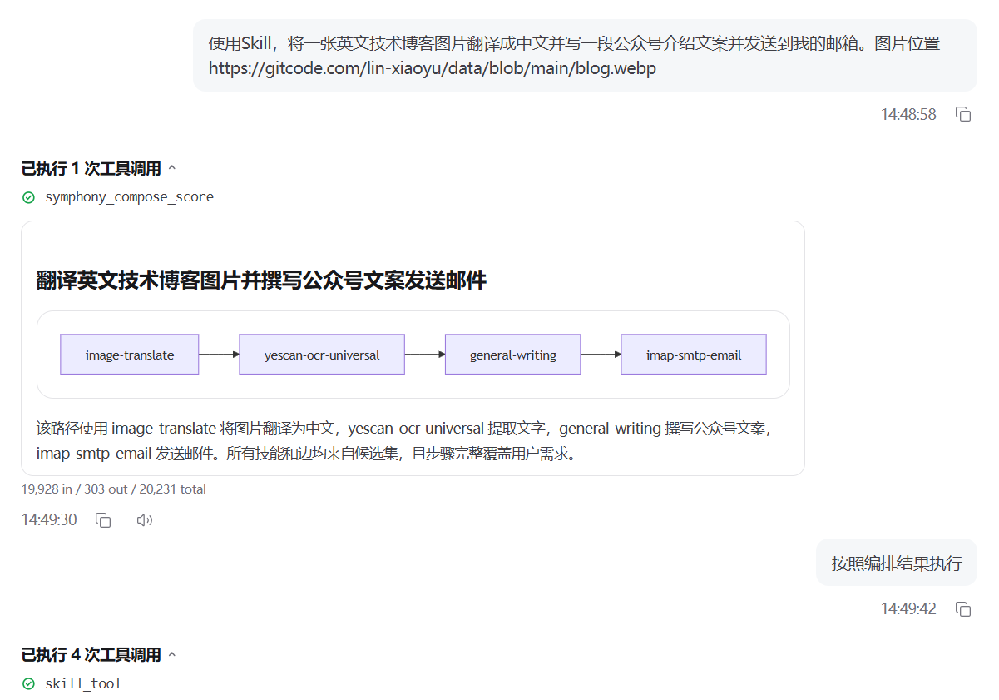

# Symphony: Skill Retrieval, Orchestration, and Dispatch
---

## Concepts

### What is Symphony?

Symphony is JiuwenSwarm's mechanism for skill retrieval, orchestration, and dispatch across a large set of installed skills. It answers two questions: **how to find the right skills**, and **how to use them together**.

- **Skill Retrieval** answers "how to find": it organizes a flat skill list into a browsable skill tree so the agent can explore likely branches and find candidate skills.
- **Skill Orchestration** answers "how to use": it uses candidate skills, input/output structures, and skill dependencies to produce a confirmable, executable skill chain.

You can think of Symphony as a two-part design: **a tree for retrieval, a graph for orchestration**. If a task only needs one clearly named skill, use the normal skill workflow. Symphony is meant for tasks that need the agent to find skills, check whether they can connect, and then form an execution route. In Team / Cluster Mode, that route can also guide how the Leader dispatches follow-up work.

#### Find candidate skills with Skill Retrieval

Skill Retrieval is JiuwenSwarm's skill-directory retrieval feature for environments with a **large number of installed skills**.

When only a few skills are installed, the agent can often inspect the skill list directly. When dozens or hundreds of skills are installed, injecting every skill into the prompt causes two common problems:

| Problem | Impact |
|---------|--------|
| High context usage | User tasks, files, and conversation history have less room |
| Attention dilution | The model may focus on irrelevant skills and miss the right one |

Skill Retrieval builds a local **installed-skill tree index** and exposes directory-browsing tools at runtime. The agent can inspect likely branches step by step, then decide which `SKILL.md` files to read.

#### Build an execution route with Skill Orchestration

If Skill Retrieval answers "which skills should participate", Skill Orchestration answers "how should they work together". For example, a task such as "recognize text from an image, translate it, write copy, and send an email" usually cannot be completed by one skill alone. Candidate skills need to be arranged into a stable route based on input/output dependencies.

Skill Orchestration builds an executable route from the task goal, current inputs, candidate skills, and connectable relationships in the skill score. When an input is missing, the system can look backward through the graph for an upstream skill that may provide it. After the route is confirmed, JiuwenSwarm continues with the actual skill execution.

The important part is not listing skills in order. Skill Orchestration checks whether upstream results can actually feed downstream skills. Connectable relationships, input/output structures, and task semantics all affect the final route. The result is not just a set of "related" skills, but a skill chain whose dependencies can be explained, confirmed, and executed.

The skill score is the graph used by orchestration. Each node represents a skill. Each edge means one skill's output can be used as another skill's input, in other words, a connectable relationship. It helps users understand possible skill combinations and gives orchestration candidate relationships to work from.



The skill score shows statically built connectable candidate relationships, and it does not guarantee every visible connection can be chained directly for every task. Always check the skill details, required inputs, and current task goal.

Capability scanning, fingerprint extraction, normalization, and quality evaluation
are provided by agent-core. JiuwenSwarm keeps only the application Adapter and
graph publication flow. A score build publishes the canonical
`fingerprint.json`, whose per-capability quality result and evidence are embedded
in each fingerprint; the former `fingerprints.json` and separate evaluation
artifacts are no longer produced.

#### Improve orchestration from Session execution traces

When **Dynamic Graph** is enabled, Symphony asynchronously reads JiuwenSwarm's existing Session JSON history after each conversation completes. It correlates the orchestration result with observed Skill calls and results. Repeated successful edges receive bounded reinforcement for later relevant tasks, while explicitly failed edges are downranked. A displayed orchestration graph without an observed Skill call is not counted as success evidence.

Dynamic data is a replayable overlay on top of the static graph; it never overwrites the permanent static graph. Turning the switch off immediately returns planning to static-only behavior while retaining existing dynamic data.

#### What problem does it solve?

- **Too many skills to inspect directly**: Skill Retrieval avoids putting every skill description into context and lets the agent find candidates step by step.
- **Knowing which skills are relevant is not enough**: orchestration checks whether upstream outputs can actually feed downstream inputs.
- **Multi-skill workflows need stable chaining**: the skill score's connectable relationships help form confirmable, executable skill chains instead of ad hoc runtime stitching.
- **Complex tasks need explanation and dispatch**: users or Leaders can see why each skill was selected, how results flow, and how follow-up work can be dispatched.

### End-to-end workflow

```text
Install skills
  v
Build the local skill tree index
  v
Build or read the skill score
  v
User sends a task
  v
The agent selects skill-tree branches for the task
  v
skill_branch_explore expands relevant branches
  v
skill_branch_peek checks branch summaries when needed
  v
Candidate skills are found
  v
Skill Orchestration builds a skill chain from the task goal, candidate skills, and skill score
  v
User confirms
  v
JiuwenSwarm continues with concrete skill execution
  v
Asynchronously consume Session JSON after the conversation (dynamic graph only)
  v
Update runtime events and the dynamic overlay for later orchestration
```

Skill Retrieval mainly finds skills. Skill Orchestration organizes candidate skills into a task-oriented execution route. The skill score records and displays whether skills can connect, giving orchestration the graph relationships it needs. Skill Retrieval and Skill Orchestration are Symphony's two core capabilities.

### Runtime tools

When Skill Retrieval is enabled, the agent receives skill-directory browsing tools. When Skill Symphony is enabled, the agent receives graph and orchestration tools. Users usually do not need to call these tools manually; the system chooses them based on the task.

#### Skill Retrieval tools

| Tool | What it does | When to use |
|------|--------------|-------------|
| `skill_branch_explore` | Expands a skill-tree branch and reveals child branches or candidate skills | Main retrieval tool, used to inspect relevant branches |
| `skill_branch_peek` | Shows a lightweight branch summary without expanding the full tree | Use when it is unclear whether a branch is worth expanding |
| `skill_index_build` | Builds or refreshes the local installed-skill tree index | Use only when retrieval tools explicitly report a missing or stale index |

When `skill_branch_explore` returns a `skills` section, those entries are installed skills, not branch IDs. The agent narrows candidates by skill name, description, and returned `worker_id`. If orchestration is needed later, those `worker_id` values can be passed to `symphony_compose_graph` as `candidate_skill_ids`.

#### Skill Orchestration tools

| Tool | What it does | When to use |
|------|--------------|-------------|
| `symphony_read_graph` | Checks whether the skill score exists and whether it is stale | Before orchestration, when the current score state needs to be known |
| `symphony_refresh_graph` | Extracts installed-skill features and refreshes the skill score | When the score is missing, stale, or skills were newly installed or changed |
| `symphony_compose_graph` | Main orchestration entry. Builds an execution graph from the task goal, candidate skills, and skill score | When the user asks to use skills, or the task needs a skill chain, skill ordering, or a specialized tool chain |

The core parameter of `symphony_compose_graph` is `query`, the original user task. The current orchestration mode is `fast`. If Skill Retrieval has already narrowed the candidate set, pass the `worker_id` list from `skill_branch_explore` into `candidate_skill_ids`; Symphony will compose a skill chain from those candidates and their connectable neighbors. If the result says no suitable skill is available, install the required skill from the **Skills** page, call `symphony_refresh_graph` to refresh the score, and then compose again with the original task.

---

## Operation Guide

### 1. Prepare installed skills

Symphony only uses installed skills. Install the skills you need from the left sidebar **Skills** page first.

See [Skills](Skills.md) for installation methods.

### 2. Enable Skill Retrieval

Open:

```text
Left sidebar -> Configuration -> Skill Retrieval
```

Enable **Skill Retrieval** and save the configuration.

When the switch is disabled, JiuwenSwarm does not register retrieval tools or inject skill-tree guidance. The system returns to the original skill workflow.

### 3. Build the skill index

Open:

```text
Left sidebar -> Skills -> Skill Index -> Build Index
```

The build scans installed skills, reads names, descriptions, and `SKILL.md`, then writes a local skill-tree index. After a successful build, the same index is reused; it does not need to be rebuilt on every startup.

Rebuild when:

- Skills were installed, uninstalled, or heavily modified.
- The UI reports that the index is missing, stale, or failed.
- Build settings such as root categories or max tree depth changed.

### 4. Build the skill score

Open:

```text
Left sidebar -> Skills -> Skill Graph
```

#### How to read the skill graph

| Element | Description |
|---------|-------------|
| **Node** | An installed skill. The node label usually matches the skill name or skill ID |
| **Edge** | A connectable relationship between two skills, meaning the upstream skill output can be used by the downstream skill |
| **Direction** | `A -> B` means skill A can feed its output into skill B |
| **Confidence** | How confident the system is that this edge is usable; higher confidence is a stronger orchestration candidate |
| **In-degree** | How many upstream skills can feed into this skill under the current filters |
| **Out-degree** | How many downstream skills this skill can feed under the current filters |

#### Page areas

| Area | Purpose |
|------|---------|
| **Left panel** | Shows visible skill/edge counts, search, minimum confidence, and the skill list |
| **Canvas** | Shows the relationship graph. Drag to pan, scroll to zoom, and click a node to inspect it |
| **Right details** | Shows the selected skill's ID, in-degree, out-degree, description, inputs, outputs, tasks, and related edges |

In **Related edges**:

- `->` means the selected skill can provide output to the target skill.
- `<-` means the selected skill can receive output from an upstream skill.
- `Connectable - 85%` shows the edge type and confidence.

#### Common actions

| Action | Description |
|--------|-------------|
| **Search skills** | Enter keywords in the left search box to show matching skills and related relationships |
| **Adjust minimum confidence** | Hide lower-confidence edges so you can focus on stronger skill handoffs |
| **Read score** | Reload the existing built skill score |
| **Incremental build** | Update the score after adding, removing, or changing skills |
| **Cancel build** | Cancel a long-running score build while keeping completed cache and checkpoints |
| **Full rebuild** | Recompute everything when the score looks stale or incorrect |
| **Fit view** | Re-center and scale the visible graph |

#### Minimum confidence

The minimum confidence slider only filters the already loaded graph locally. It can hide edges below the current threshold, but it does not recompute relationships and cannot reveal edges below the build-time acceptance threshold. To regenerate candidate relationships, run an incremental build or full rebuild.

### 5. Use Skill Retrieval in chat

Users usually do not call the tools directly. Send a normal task, for example:

```text
Please prioritize currently installed skills for this task. If relevant skills are found, use their contents in your answer.

I have a PDF contract and an Excel spreadsheet. Extract key clauses, verify amount fields, and generate a Chinese review report.
```

With Skill Retrieval enabled, the model can browse the skill tree, discover PDF, Excel, document review, or report-generation skills, and then decide which `SKILL.md` files to read.

### 6. Inspect the retrieval process

In the chat message, expand the skill retrieval tree to see:

- Which top-level categories the model inspected.
- Which branches were peeked.
- Which branches were explored.
- Which candidate skills appeared.

When a skill looks relevant, the agent may read its `SKILL.md` before executing the task.

### 7. Use Skill Orchestration

#### Before you use it

1. Open left sidebar -> **Configuration** -> **Other configuration**.
2. Expand **Skill Symphony** and turn on **Enable skill orchestration**. To learn from real execution traces, also turn on **Enable dynamic graph**, then click **Save** in the top-right corner.
3. Confirm the required skills are installed. If you recently added, removed, or changed skills, open **Skills** -> **Skill Graph** and run **Incremental build**. If you only need to confirm the current score state, use **Read score**.

**Enable skill orchestration** is the Symphony master switch. **Enable dynamic graph** takes effect only while orchestration is enabled. Skill Retrieval is still controlled by the separate **Skill Retrieval** switch.



#### Recommended prompt style

In chat, say that you want to use skills, and provide the goal, input material, expected output, and follow-up action in one request.

**Template:**

```text
Use Skill to complete <final goal>.
The input is <file, link, text, or account information>.
I need <output format or deliverable>, then <whether to continue with the next action>.
```

**Example:**

```text
Use Skill to translate an English technical blog image into Chinese,
write a WeChat public-account intro copy, and send it to my email.
Image URL: XXX
```

Prompts that trigger Skill Orchestration more reliably:

- Explicitly say "Use Skill" or "use skills".
- Describe the complete goal instead of only one step.
- If you want the system to continue after planning, reply with "execute according to the orchestration result" or "confirm and continue".

#### Understand the orchestration result

After Skill Symphony is enabled, the system first returns a skill orchestration graph and a short explanation. Each box is a skill, and each arrow shows execution order and result handoff. In the example below, the route is `image-translate -> yescan-ocr-universal -> general-writing -> imap-smtp-email`: translate the image, extract text, write copy, then send the email.



After seeing the route, you can respond in one of these ways:

- **Route looks right**: reply "execute according to the orchestration result".
- **Missing information**: provide the missing file, link, email address, account, or parameter.
- **Plan only**: stop after the orchestration result and use it as a skill-combination suggestion.

> **Tip:** Skill Orchestration only uses currently installed skills and available configuration. If the result says no suitable skill is available, install the required skill first, then refresh or rebuild the skill score and try again.

---

## Configuration

The Web configuration page exposes three related switches: **Enable Skill Retrieval** controls skill-tree retrieval tools, **Enable skill orchestration** controls skill score and orchestration tools, and **Enable dynamic graph** controls whether Session execution traces are learned from and used by later orchestration. The Skill Index page provides index build, rebuild, cancel, status, and tree viewing operations. The Skill Graph page provides score reading, incremental build, cancel build, and full rebuild operations.

Advanced build, retrieval, and orchestration settings are configured in the user runtime config file:

```text
~/.jiuwenswarm/config/config.yaml
```

### Configuration items

#### `symphony.enabled`

Whether to enable Symphony orchestration. The default template value is `false`.

When enabled, new sessions register orchestration tools such as `symphony_read_graph`, `symphony_refresh_graph`, and `symphony_compose_graph`. The agent can read or refresh the skill score and build a skill chain from candidate skills. When disabled, these tools are not registered and the agent does not use the skill score for orchestration.

This switch controls Symphony orchestration tools. Skill Retrieval is still controlled separately by `symphony.skill_retrieval.enabled`: retrieval finds candidate skills, and orchestration builds an execution route from the task goal, candidate skills, and the skill score.

#### `symphony.paths.skills_root` / `symphony.paths.graph_dir`

The skill source directory and skill score artifact directory. Both default template values are empty strings, which means the runtime default directories are used.

`symphony_refresh_graph` reads skills from `skills_root` and refreshes the skill score. `symphony_read_graph` and `symphony_compose_graph` read score artifacts from `graph_dir`. Configure these paths explicitly when the score needs to be cached in a fixed location or reused across runtime environments.

#### `symphony.build`

Graph construction keeps up to `32` candidates per Skill/relation and uses `0.5` as the edge acceptance threshold by default. Tune the cap with `max_candidates_per_skill_relation`; the effective value is recorded in the build manifest for reproducibility and diagnosis.

#### `symphony.orchestration`

Runtime parameters for Skill Orchestration. The current template is:

| Setting | Default | Description |
|---------|---------|-------------|
| `mode` | `fast` | Orchestration mode. The current runtime tools use the fast orchestration path and prioritize an executable skill chain |
| `max_depth` | `4` | Maximum skill-chain search depth, limiting how many skills can be chained in one task |
| `min_edge_confidence` | `0.5` | Minimum confidence threshold for skill-score edges. Edges below this value are not preferred for orchestration |

These settings tune how candidate skills are connected into a route. If routes are too short or often miss intermediate steps, consider increasing `max_depth`. If routes often use low-confidence connections, consider increasing `min_edge_confidence`.

#### `symphony.skill_retrieval.enabled`

Whether to enable Skill Retrieval. The default template value is `false`. This setting can be configured from the Web UI.

When enabled, new sessions receive `skill_branch_explore`, `skill_branch_peek`, `skill_index_build`, and related retrieval guidance. When disabled, those tools and prompts are not registered, and the system returns to the original skill flow.

Use it when many installed skills need to be searched by task. If there are only a few skills, or if you want to use the original `list_skills` workflow, leave it disabled.

#### `symphony.skill_retrieval.build.root_categories`

`root_categories` defines the first layer, and optionally the second layer, of the skill tree before index construction starts.

When many skills are installed, letting the LLM freely invent root categories can make the tree unstable across builds. `root_categories` provides a stable directory skeleton: the LLM first distributes skills into these high-level categories, then dynamically splits each category further.

You can customize the default tree hierarchy for your application. It can be written as a YAML list. Each category should include:

- `id`: stable, short, and limited to lowercase letters, numbers, and hyphens.
- `name`: human-readable display name.
- `description`: what the category covers.
- `select_when`: when this category should be selected.
- `dont_select_when`: when this category should not be selected.
- `children`: optional preset second-level categories.

Good categories should:

- Cover common tasks.
- Be as mutually exclusive as practical.
- Use concise descriptions that are easy for the model to judge.

Set this manually in the user config file when customization is needed, then rebuild the index.

One-level example:

```yaml
symphony:
  skill_retrieval:
    build:
      root_categories:
        - id: office-docs
          name: Office documents
          description: Generate, edit, convert, extract, format, and structure office files.
          select_when: The user needs to process Word, PDF, PPT, Excel, Markdown, email, meeting notes, or office workflow deliverables.
          dont_select_when: The user is only writing general articles, managing notes, searching the web, developing web pages, generating media, or checking financial data.
        - id: system-tools
          name: System tools
          description: Device, file, cloud, agent/skill management, automation, safety, and connection configuration.
          select_when: The user asks to operate devices, manage files or cloud storage, configure channels, create skills/agents, switch personas, manage tasks, or run safety checks.
          dont_select_when: The user mainly wants a concrete business result such as writing a document, researching, making media, planning travel, or analyzing finance.
```

Two-level example:

```yaml
symphony:
  skill_retrieval:
    build:
      root_categories:
        - id: office-docs
          name: Office documents
          description: Read, convert, extract, edit, and generate office files.
          select_when: The task centers on PDF, Word, PPT, Excel, CSV, contracts, reports, or tables.
          dont_select_when: The user is mainly developing code, generating media, operating SaaS, or doing open web search.
          children:
            - id: pdf-and-ocr
              name: PDF and OCR
              description: PDF reading, splitting, merging, OCR, layout recognition, and document-to-text workflows.
            - id: spreadsheets-and-tables
              name: Spreadsheets and tables
              description: Excel, CSV, table extraction, formulas, field checks, and table cleanup.
            - id: presentations-and-reports
              name: Presentations and reports
              description: PPT, formal reports, charts in documents, and business-facing deliverables.
```

#### `symphony.skill_retrieval.build.branching_factor`

The split-threshold base for skill-tree construction. The current template default is `128`.

This does not require the LLM to generate a fixed number of branches. It is mainly used to derive the stopping threshold for splitting nodes: in the current implementation, a node usually stops splitting when its skill count is no more than about `branching_factor * 1.5`.

Lower values create a finer tree with more branches and slower builds, but fewer skills per leaf. Higher values create a coarser tree with faster builds, but more skills under each branch.

Use it to tune skill-tree granularity. With hundreds or thousands of skills, lower it if each branch still has too many candidate skills; raise it if builds are too slow or the tree is too fragmented.

#### Other Skill Retrieval settings

| Setting | Default | Description |
|---------|---------|-------------|
| `artifact_root` | Empty string | Index artifact directory; empty means the default workspace is used |
| `build.max_depth` | `6` | Maximum skill-tree depth |
| `build.max_workers` | `2` | Build concurrency; higher values can be faster but put more pressure on the model provider |
| `build.max_retries` | `2` | Retry count for failed LLM classification or grouping calls |
| `build.request_timeout_seconds` | `420` | Timeout for one LLM build request |
| `build.total_timeout_seconds` | `0` | Total build timeout; `0` means unlimited |
| `build.classification_batch_limit` | `32` | Maximum number of skills per classification call |
| `build.discovery_seed` | `42` | Random seed used during build sampling for better reproducibility |

#### Example configuration

```yaml
symphony:
  enabled: true
  paths:
    skills_root: ""
    graph_dir: ""

  build:
    max_candidates_per_skill_relation: 32
    min_edge_confidence: 0.5

  evolution:
    enabled: true

  orchestration:
    mode: fast
    max_depth: 4
    min_edge_confidence: 0.5

  skill_retrieval:
    enabled: true
    artifact_root: ""
    build:
      branching_factor: 128
      max_depth: 6
      root_categories:
        - id: office-docs
          name: Office documents
          description: Generate, edit, convert, extract, format, and structure office files.
          select_when: The user needs to process Word, PDF, PPT, Excel, Markdown, email, meeting notes, or office workflow deliverables.
          dont_select_when: The user is only writing general articles, managing notes, searching the web, developing web pages, generating media, or checking financial data.
        - id: system-tools
          name: System tools
          description: Device, file, cloud, agent/skill management, automation, safety, and connection configuration.
          select_when: The user asks to operate devices, manage files or cloud storage, configure channels, create skills/agents, switch personas, manage tasks, or run safety checks.
          dont_select_when: The user mainly wants a concrete business result such as writing a document, researching, making media, planning travel, or analyzing finance.
      max_workers: 2
      max_retries: 2
      request_timeout_seconds: 420
      total_timeout_seconds: 0
      classification_batch_limit: 32
      discovery_seed: 42
      postprocess_enabled: true
      postprocess_max_passes: 1
      postprocess_min_skills: 6
      equivalence_enabled: false
    retrieve:
      compact_codes_enabled: false
      flatten_tree: false
      max_exposure_depth: 1
```

---

## FAQ

### Why did the model not call retrieval tools?

Possible reasons:

- The task already named a specific skill.
- The task does not need installed skills.
- The index is missing and retrieval has not been triggered yet.
- The Skill Retrieval switch is disabled.

You can make the intent explicit: "Please prioritize currently installed skills for this task."

### Why does the tool say the index is missing?

Open:

```text
Skills -> Skill Index -> Build Index
```

Alternatively, let the model call `skill_index_build` after a retrieval tool explicitly asks for it. Then retry the task.

### Why does the skill index build take time?

The build reads all installed skills and calls the model to generate branches and classifications. More skills and deeper trees take longer. After the index is built, it is reused and does not need to be rebuilt for every conversation.

### Why does the skill score build take time?

The build reads installed skills and analyzes input/output and semantic handoff relationships between them. More skills and more possible connections take longer. After the score is built, you can read it directly instead of rebuilding it for every conversation.

### What is the difference between Skill Retrieval and the skill score?

Skill Retrieval finds candidate skills from a large installed-skill set. The skill score describes whether those skills can connect. The former is like browsing a directory; the latter is like inspecting a connection map.

### What is the relationship between Skill Retrieval and Skill Orchestration?

Both are part of Symphony. Skill Retrieval narrows the candidate skill set; Skill Orchestration builds an execution route from the task goal, candidate skills, and the skill score.

### Does it install new skills automatically?

No. Symphony only uses installed skills. Install new skills from the **Skills** page.

### Does it replace Team / Cluster Mode dispatch?

No. Symphony helps the Leader or agent find relevant skills and form a skill chain. Task decomposition, skill reading, tool execution, and team coordination still use JiuwenSwarm's existing runtime.

### Is building the skill score the same as composing an execution graph?

This is an easy distinction to miss: building the skill score is not composing an execution graph. Building the skill score usually happens before a task arrives and focuses on which skills in the whole installed skill set may have stable connectable relationships. Composing an execution graph happens after a task arrives and focuses on this specific request: which skills should be selected from the score, in what order they should run, and where additional inputs are needed.

---

## Related docs

- [Skills](Skills.md)
- [Configuration](Configuration.md)
- [Agent Team](AgentTeam.md)
- [Chinese: Symphony](../zh/symphony-技能编排与分发.md)
