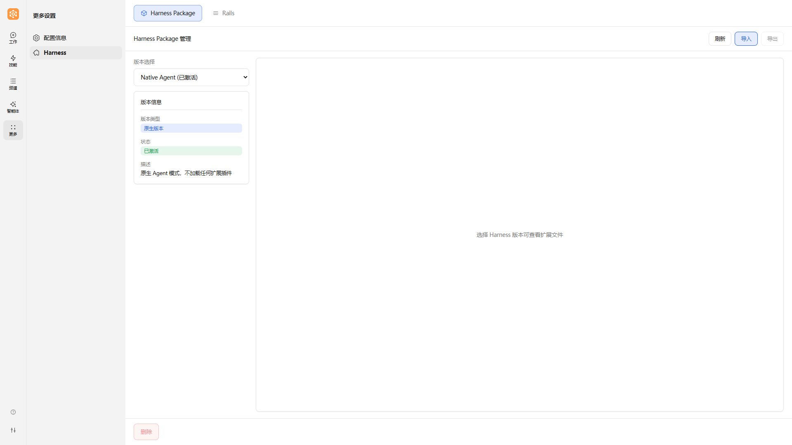
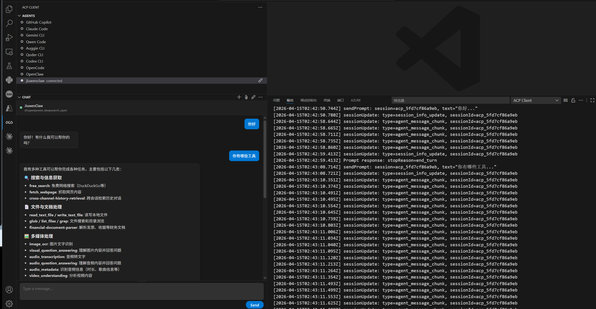

# ACP 快速启动

本文将介绍如何在本机启动 `jiuwenswarm` 主进程，并通过 VS Code ACP Client 连接使用。

## 前置要求

* Python `>=3.11, <3.14`
* 已安装 VS Code 扩展 `formulahendry.acp-client`


---

## 启动顺序

ACP 依赖本地 Gateway，**必须先启动主进程，再在 VS Code 中连接 Agent**。

顺序如下：

1. 安装 `jiuwenswarm`
2. 执行 `jiuwenswarm-init`
3. 配置大模型相关信息
4. 启动主进程
5. 在 VS Code 中配置 ACP Agent
6. 连接 Agent 开始使用

---

## 方式一：源码启动

适用于已 clone 仓库的场景。

### 1. 安装依赖

在仓库根目录执行：

```bash
uv venv --python=3.11

#激活虚拟环境
# Windows
.venv\Scripts\activate

# Linux / macOS
source .venv/bin/activate

uv sync
```

### 2. 初始化

```bash
jiuwenswarm-init
```

### 3. 配置大模型信息

执行 `jiuwenswarm-init` 后，需要按项目要求**配置大模型相关信息**，否则 Agent 无法正常推理。配置方法参考: [配置方法](配置信息.md)

### 4. 启动主进程

```bash
python -m jiuwenswarm.app
```

### 5. 在 VS Code 中配置 ACP

在 ACP Client 插件中执行 **ACP: Add Agent Configuration**，然后填写：

* **Name**：`jiuwenswarm`
* **Command**：

  * Windows：`<repo>/scripts/run_gateway_acp.cmd`
  * Linux / macOS：`<repo>/scripts/run_gateway_acp.sh`
* **Config / Arguments**：留空

> 说明：仓库脚本默认使用仓库根目录下的 `.venv`。




### 6. 建立连接

完成上述配置后，在 ACP Client 中连接 jiuwenswarm Agent 即可开始使用。



---

## 方式二：Wheel 启动

适用于直接通过 Wheel 包安装启动的场景。

### 1. 安装

```bash
python -m venv .venv

# Windows
.venv\Scripts\activate

# Linux / macOS
source .venv/bin/activate

pip install jiuwenswarm
```

### 2. 初始化

```bash
jiuwenswarm-init
```

### 3. 配置大模型信息

执行 `jiuwenswarm-init` 后，需要按项目要求**配置大模型相关信息**，否则 Agent 无法正常推理。配置方法参考: [配置方法](配置信息.md)

### 4. 启动主进程

```bash
python -m jiuwenswarm.app
```

### 5. 在 VS Code 中配置 ACP

在 ACP Client 插件中执行 **ACP: Add Agent Configuration**，然后填写：

* **Name**：`jiuwenswarm`
* **Command**：`jiuwenswarm-acp`
* **Config / Arguments**：留空

> 说明：`jiuwenswarm-acp` 是 pip install 后自动生成的命令，与 `jiuwenswarm-init`、`jiuwenswarm-start` 同级。需确保 VS Code 在已安装 jiuwenswarm 的虚拟环境中运行，否则需填写完整路径，例如 Windows：`C:\path\to\venv\Scripts\jiuwenswarm-acp.exe`，Linux / macOS：`/path/to/venv/bin/jiuwenswarm-acp`。


### 6. 建立连接

完成上述配置后，在 ACP Client 中连接 jiuwenswarm Agent 即可开始使用。


