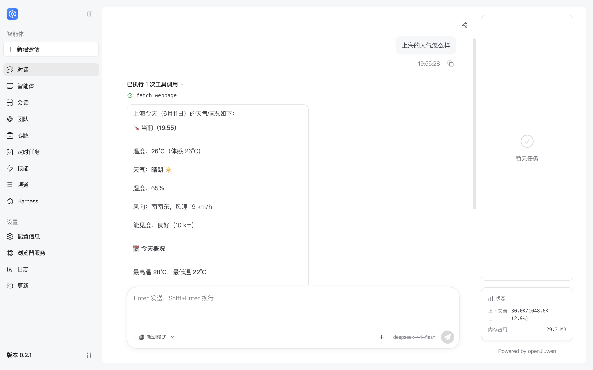

# JiuwenSwarm 安装指南

> **重要提醒：** 安装完成并不代表直接可用，需要先完成模型配置。请参考[配置信息](https://gitcode.com/openJiuwen/jiuwenswarm/blob/develop/docs/zh/%E9%85%8D%E7%BD%AE%E4%BF%A1%E6%81%AF.md)进行模型配置

---

## 安装前准备

在安装 JiuwenSwarm 之前，请确保您的系统满足以下要求：

| 依赖项 | 版本要求 | 说明 |
|--------|----------|------|
| 操作系统 | Windows 10/11, macOS 10.15+, Linux | 支持主流操作系统 |
| Python | ≥3.11, <3.14 | 推荐使用 Python 3.11 |
| Node.js | 18.x 或更高版本 | 用于前端界面 |
| Git | 最新版本 | 用于源码安装 |

### 环境检查

在终端中运行以下命令检查环境：

```bash
# 检查 Python 版本
python --version
# 预期输出：Python 3.11.x 或 Python 3.12.x

# 检查 Node.js 版本
node --version
# 预期输出：v18.x.x 或更高

# 检查 Git 版本
git --version
# 预期输出：git version 2.x.x
```

---

## 首次安装

### 方式一：桌面安装包（dmg / exe）

适用于 Windows 和 macOS 用户，希望开箱即用、不想自行配置 Python / Node.js 环境。从 gitcode Release 下载对应平台的安装包即可。从 [Release](https://gitcode.com/openJiuwen/jiuwenswarm/releases) 页面下载。

| 平台 | 下载产物 |
|------|----------|
| Windows | `JiuwenSwarm-setup-<version>.exe` |
| macOS | `JiuwenSwarm-<version>.dmg` |

下载地址：https://gitcode.com/openJiuwen/jiuwenswarm/releases

#### 1. macOS：用 curl 下载 dmg（推荐）

> ⚠️ **重要**：从浏览器下载的 `.dmg` 会被 macOS 打上隔离标签（`com.apple.quarantine`），打开时触发 GateKeeper 检查，可能提示「已损坏，无法打开」或「无法验证开发者」。改用终端 `curl` 下载，文件不会带隔离标签，可正常挂载安装。

```bash
# 把 <version> 替换为目标版本号
curl -L --fail -o JiuwenSwarm-<version>.dmg \
  https://gitcode.com/openJiuwen/jiuwenswarm/releases/download/JiuwenSwarm<version>/JiuwenSwarm-<version>.dmg
```

#### 2. 安装与首次启动

- **macOS**：双击挂载 dmg，将 `JiuwenSwarm.app` 拖入 `Applications`。由于当前 `.app` 未签名 / 未公证，在 Finder 中右键选择「打开」。
- **Windows**：双击下载的安装包（`.exe`）按提示安装，安装时会自动初始化工作区。

首次启动后，系统会创建配置目录 `~/.jiuwenswarm/`，之后请参考 [启动后验证](#3-启动后验证) 完成模型配置。

> 版本号以 Release 页面实际下载链接为准。Windows 与 macOS 桌面端的自动更新方案见 [桌面端自动更新设计](windows自动更新设计.md)。

---

### 方式二：pip 安装

#### 1. 安装步骤

```bash
# 创建虚拟环境（推荐）
python -m venv jiuwenswarm-env

# 激活虚拟环境
# Windows:
jiuwenswarm-env\Scripts\activate
# macOS/Linux:
source jiuwenswarm-env/bin/activate

# 安装 JiuwenSwarm
## 方式一：默认安装
pip install jiuwenswarm

## 方式二：使用国内镜像源（推荐）
# 清华源
pip install jiuwenswarm -i https://pypi.tuna.tsinghua.edu.cn/simple

# 阿里源
pip install jiuwenswarm -i https://mirrors.aliyun.com/pypi/simple/
```

#### 2. 首次启动

```bash
# 初始化 JiuwenSwarm（首次启动）
jiuwenswarm-init
# 启动 JiuwenSwarm
jiuwenswarm-start
```

首次启动后，系统会自动创建配置目录 `~/.jiuwenswarm/`。

#### 3. 启动后验证

启动成功后，请按以下步骤验证安装是否正确：

1. **打开 Web 端**：在浏览器中访问 `http://localhost:5173`
2. **进入配置页面**：点击左侧导航栏「配置信息」
3. **完成模型配置**：参考 [配置信息](配置信息.md) 完成模型 API 配置
4. **验证安装成功**：
   - Web 页面可正常访问
   - 完成模型配置后可进行一次基础对话



> 💡 **提示**：如果 Web 页面无法访问，请检查日志文件 `~/.jiuwenswarm/logs/` 是否有错误信息。

#### 4. 重新启动服务

如果关闭 JiuwenSwarm 后需要再次使用：

```bash
# 再次启动
jiuwenswarm-start
```

---

### 方式三：源码安装（uv 方式）

#### 1. 环境准备

确保已安装 uv。如未安装，请参考 [uv 官方文档](https://docs.astral.sh/uv/) 自行安装。

```bash
# 检查 uv 是否已安装
uv --version

#预期输出：uv 0.17.x 或更高
```

#### 2. 克隆并安装

```bash
# 克隆代码仓库
git clone https://gitcode.com/openJiuwen/jiuwenswarm.git

# 进入项目目录
cd jiuwenswarm

# 使用 uv 创建虚拟环境并安装依赖
uv venv
uv pip install -e .
```

#### 3. 构建前端

> ⚠️ **重要**：源码安装（editable install）需要手动构建前端，否则启动时会报错 `dist directory not found`。

```bash
# 进入前端目录
cd channels\web\frontend

# 安装前端依赖
npm install

# 构建前端
npm run build

# 复制构建产物到用户工作区
# Windows:
xcopy /E /I dist %USERPROFILE%\.jiuwenswarm\channels\web\frontend\dist
# macOS/Linux:
cp -r dist ~/.jiuwenswarm/channels/web/frontend/dist

# 返回项目根目录
cd ..\..
```

**说明**：
- `pip install -e .` 是 editable install，直接指向源码目录
- 源码中 `web/dist` 被 `.gitignore` 忽略，不包含构建产物
- 需要手动构建并复制到 `~/.jiuwenswarm/channels/web/frontend/dist`

#### 4. 首次启动

```bash
# 激活虚拟环境
# Windows:
.venv\Scripts\activate
# macOS/Linux:
source .venv/bin/activate

# 初始化 JiuwenSwarm（首次启动）
jiuwenswarm-init
# 启动
jiuwenswarm-start
```

#### 5. 启动后验证

验证步骤见 [启动后验证](#3-启动后验证)。

#### 6. 重新启动服务

```bash
# 激活虚拟环境后启动
jiuwenswarm-start
```

---

### 方式四：源码安装（conda 方式）

#### 1. 环境准备

确保已安装 conda。如未安装，请参考 [Miniconda 官方文档](https://docs.conda.io/en/latest/miniconda.html) 自行安装。

```bash
# 检查 conda 是否已安装
conda --version
# 预期输出：conda 23.x.x 或更高
```

#### 2. 创建 conda 环境

```bash
# 创建虚拟环境
conda create -n jiuwenswarm python=3.11

# 初始化环境（首次）
conda init
# 初始化之后，关闭窗口。再重新打开会话执行激活命令

# 激活环境
conda activate jiuwenswarm
```

#### 3. 克隆并安装

```bash
# 克隆代码仓库
git clone https://gitcode.com/openJiuwen/jiuwenswarm.git

# 进入项目目录
cd jiuwenswarm

# 安装依赖
pip install -e .
```

#### 4. 构建前端

> ⚠️ **重要**：源码安装（editable install）需要手动构建前端，否则启动时会报错 `dist directory not found`。

```bash
# 进入前端目录
cd channels\web\frontend

# 安装前端依赖
npm install

# 构建前端
npm run build

# 复制构建产物到用户工作区
# Windows:
xcopy /E /I dist %USERPROFILE%\.jiuwenswarm\channels\web\frontend\dist
# macOS/Linux:
cp -r dist ~/.jiuwenswarm/channels/web/frontend/dist

# 返回项目根目录
cd ..\..
```

**说明**：
- `pip install -e .` 是 editable install，直接指向源码目录
- 源码中 `web/dist` 被 `.gitignore` 忽略，不包含构建产物
- 需要手动构建并复制到 `~/.jiuwenswarm/channels/web/frontend/dist`

#### 5. 首次启动

```bash
# 初始化 JiuwenSwarm（首次启动）
jiuwenswarm-init
# 启动
jiuwenswarm-start
```

#### 6. 启动后验证

验证步骤见 [启动后验证](#3-启动后验证)。

#### 7. 重新启动服务

```bash
# 激活环境后启动
conda activate jiuwenswarm
jiuwenswarm-start
```

---

## 版本升级

| 当前版本范围 | 升级方式 | 说明 |
|--------------|----------|------|
| 常规版本（如0.1.8 → 0.1.9，不跨0.1.7版本） | [常规版本升级](#常规版本升级) | 直接升级，无需备份 |
| 重大版本（如<0.1.7 → >0.1.7，跨0.1.7版本） | [重大版本升级](#重大版本升级) | 需要先备份数据 |

---

### 常规版本升级

#### pip 安装升级

```bash
# 激活虚拟环境
# 然后执行升级
pip install --upgrade jiuwenswarm
```

#### 源码安装升级

```bash
# 进入项目目录
cd jiuwenswarm

# 拉取最新代码
git pull

# 重新安装
pip install -e .

# 重新构建前端（如有更新）
cd channels\web\frontend
npm install
npm run build

# 复制构建产物
# Windows:
xcopy /E /I dist %USERPROFILE%\.jiuwenswarm\channels\web\frontend\dist
# macOS/Linux:
cp -r dist ~/.jiuwenswarm/channels/web/frontend/dist

cd ..\..\..
```

---

### 重大版本升级

> ⚠️ 跨主版本升级前，请务必备份数据！

#### 1. 数据备份步骤

**Windows 系统：**

```bash
# 备份整个配置和数据目录
xcopy "%USERPROFILE%\.jiuwenswarm" "%USERPROFILE%\.jiuwenswarm_backup" /E /I

# 或使用 PowerShell（推荐）
Copy-Item -Path "$env:USERPROFILE\.jiuwenswarm" -Destination "$env:USERPROFILE\.jiuwenswarm_backup" -Recurse
```

**macOS/Linux 系统：**

```bash
# 备份整个配置和数据目录
cp -r ~/.jiuwenswarm ~/.jiuwenswarm_backup

# 或使用 rsync（推荐，保留权限和属性）
rsync -av ~/.jiuwenswarm ~/.jiuwenswarm_backup
```

**备份内容说明：**

| 目录/文件 | 说明 |
|-----------|------|
| `config/config.yaml` | 主配置文件（模型、API密钥等） |
| `config/.env` | 环境变量配置 |
| `agent/memory/` | 用户记忆数据 |
| `agent/home/` | 身份与任务信息 |
| `agent/skills/` | 技能库（自定义技能和配置） |
| `agent/workspace/` | 工作区文件 |

#### 2. 执行升级

根据您的安装方式，选择对应的升级方法：

##### pip 安装升级

步骤与 [常规版本升级 - pip 安装升级](#pip-安装升级) 完全相同，请直接按该小节执行。

##### 源码安装升级

步骤与 [常规版本升级 - 源码安装升级](#源码安装升级) 完全相同，请直接按该小节执行。

#### 3. 数据迁移

升级完成后，需要进行数据迁移以确保配置和数据兼容新版本。

##### 步骤一：检查配置文件变更

```bash
# 查看新版本的配置模板（源码安装）
cat docs/config_template.yaml

# 或查看配置变更日志
# https://gitcode.com/openJiuwen/jiuwenswarm/blob/develop/docs/CHANGELOG.md
```

##### 步骤二：配置文件迁移

1. **对比新旧配置文件结构**

   新版本可能引入新的配置项或废弃旧配置项。请检查：
   - `config.yaml` 中是否有新增必填项
   - `.env` 中是否有新的环境变量
   - 旧配置项是否被废弃或重命名

2. **手动迁移配置**

   ```bash
   # 备份新版本的默认配置
   cp ~/.jiuwenswarm/config/config.yaml ~/.jiuwenswarm/config/config.yaml.new

   # 从备份恢复旧配置（谨慎操作）
   # 建议使用文本编辑器对比合并，而非直接覆盖
   ```

3. **常见配置迁移场景**

   | 场景 | 处理方式 |
   |------|----------|
   | 新增模型支持 | 在 `config.yaml` 中添加新的模型配置项 |
   | API 端点变更 | 更新 `.env` 中的 API 地址 |
   | 配置项重命名 | 按更新日志映射旧项到新项 |
   | 废弃配置项 | 删除不再使用的配置项 |

##### 步骤三：记忆数据迁移

记忆数据通常向后兼容，但建议检查：

```bash
# 检查记忆目录结构
ls ~/.jiuwenswarm/agent/memory/

# 如有异常，可从备份恢复
cp -r ~/.jiuwenswarm_backup/agent/memory/* ~/.jiuwenswarm/agent/memory/
```

##### 步骤四：验证迁移结果

```bash
# 启动服务
jiuwenswarm-start

# 检查日志是否有配置错误
# 日志位置：~/.jiuwenswarm/logs/
```

**迁移检查清单：**

- [ ] 服务能正常启动
- [ ] 模型配置生效（能正常对话）
- [ ] 历史记忆数据可访问
- [ ] 自定义配置已迁移
- [ ] 无报错或警告信息

---

## 常见问题

### Q: 启动时报错 "Python version not supported"

请确保 Python 版本 ≥3.11 且 <3.14。Python 版本检查详见：[环境检查](#环境检查)

### Q: 启动时报错 "Node.js not found"

请安装 Node.js 18.x 或更高版本。Node.js 版本检查详见：[环境检查](#环境检查)

### Q: 如何查看当前版本？

```bash
pip show jiuwenswarm
```

### Q: 如何卸载？

```bash
pip uninstall jiuwenswarm
```

---

## 相关链接

- **代码仓库：** https://gitcode.com/openJiuwen/jiuwenswarm
- **问题反馈：** https://gitcode.com/openJiuwen/jiuwenswarm/issues
- **文档中心：** https://gitcode.com/openJiuwen/jiuwenswarm/tree/develop/docs

---

*最后更新：2026-04-10*
