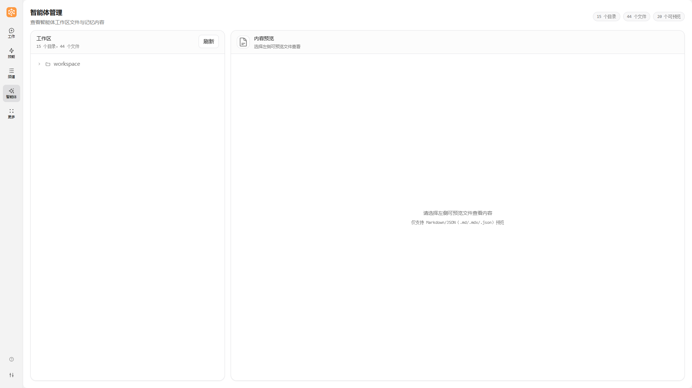

# 智能体

本文档帮助用户全面理解 JiuwenSwarm 中的"智能体"概念，包括其定义、组成结构、本地目录以及日常操作指导。

---

## 概念科普

### 智能体是什么

JiuwenSwarm 中的"智能体"（Agent）是一个具备自主执行能力的数字化助手。它不是单纯的大语言模型，而是由多个组件协同构成的执行主体。

**核心定义：**

智能体 = 角色设定 + 工具 + 技能 + 记忆 + 工作空间 + 配置

> **说明**：上述 6 项为构成单个智能体的核心组件。其中工作空间包含待办、会话、文件存储等运行数据。当多个智能体组合协作时，还可以形成跨智能体的**协同能力**，实现任务分解与并行执行。

**与普通大模型对话的区别：**

| 特性 | 普通大模型对话 | JiuwenSwarm 智能体 |
|------|---------------|------------------|
| 执行能力 | 仅生成文本回复 | 可调用工具执行实际操作（读写文件、运行命令、搜索网络等） |
| 记忆能力 | 会话内短期记忆 | 跨会话长期记忆，可记住用户偏好、历史决策 |
| 技能扩展 | 固定能力 | 可加载技能模块，扩展专业能力 |
| 工作空间 | 无 | 拥有独立工作空间，管理任务、待办、会话 |
| 配置管理 | 无 | 独立配置系统，支持模型参数、通道连接、权限控制 |
| 个性化 | 无 | 可通过角色设定、配置定制行为风格 |

**智能体与各组件的关系：**

```
┌─────────────────────────────────────────────────────┐
│                    智能体 (Agent)                    │
├─────────────────────────────────────────────────────┤
│  ┌─────────┐  ┌─────────┐  ┌─────────┐  ┌─────────┐ │
│  │ 角色设定 │  │  工具   │  │  技能   │  │  记忆   │ │
│  │(Identity)│  │(Tools) │  │(Skills)│  │(Memory)│ │
│  └─────────┘  └─────────┘  └─────────┘  └─────────┘ │
│  ┌───────────────────────────────────────────────┐ │
│  │              工作空间 (Workspace)              │ │
│  │  ┌─────────┐  ┌─────────────────────────────┐ │ │
│  │  │  待办   │  │          会话管理           │ │ │
│  │  │ (Todo) │  │       (Sessions)            │ │ │
│  │  └─────────┘  └─────────────────────────────┘ │ │
│  └───────────────────────────────────────────────┘ │
│  ┌───────────────────────────────────────────────┐ │
│  │                配置 (Config)                   │ │
│  └───────────────────────────────────────────────┘ │
└─────────────────────────────────────────────────────┘
```

**理解要点：**

1. **角色设定**：定义智能体的身份、性格、行为风格，决定"它是谁"
2. **工具**：智能体的"手脚"，用于执行文件操作、网络搜索、代码运行等
3. **技能**：可加载的专业能力模块，如 Git 操作、文档生成等
4. **记忆**：存储用户信息、历史对话、决策记录，实现跨会话连贯性
5. **工作空间**：智能体的"办公桌"，管理任务进度、待办、会话状态
6. **配置**：智能体的"设置面板"，管理模型参数、通道连接、权限等

> **提示**：本节以理解概念为主，不涉及底层实现细节。后续章节将逐步展开各组件的具体内容。相关文档请参考：[配置信息](配置信息.md)、[记忆](记忆.md)、[Skill自演进](Skill自演进.md)。

---

## Web 前端智能体页面

在 Web 前端中，「**智能体**」页面是一个**工作区文件浏览器**，用于查看智能体的工作区文件与记忆内容。



### 页面功能

| 功能 | 说明 |
|------|------|
| **工作区浏览** | 浏览智能体工作区目录结构，查看文件和目录 |
| **文件预览** | 预览工作区中的可预览文件内容 |
| **刷新** | 刷新工作区文件列表 |

### 操作步骤

1. 在左侧导航栏点击「**智能体**」
2. 页面左侧显示工作区目录结构（如 `workspace/`）
3. 点击目录展开查看文件列表
4. 点击可预览的文件，右侧显示文件内容预览

> **提示**：智能体页面主要用于查看工作区文件，如需修改配置，请前往「**更多**」→「**配置信息**」页面。

---

## 组成结构

### 智能体由哪些部分组成

智能体包含 **6 个核心组件** 和 **1 个协作能力**（多智能体协同），每部分承担不同职责。用户可根据需要关注和调整相应内容。

**组成总览表：**

| 组成部分 | 类型 | 作用说明 | 用户关注程度 | 主要影响 |
|----------|------|----------|--------------|----------|
| **角色设定** | 核心组件 | 定义智能体的身份、性格、回复风格 | 可定制 | 影响对话风格、行为偏好 |
| **工作空间** | 核心组件 | 存储任务、待办、会话、配置等运行数据 | 了解即可 | 影响任务管理、状态持久化 |
| **工具** | 核心组件 | 提供文件操作、网络搜索、代码执行等能力 | 一般不需修改 | 影响智能体可执行的操作范围 |
| **技能** | 核心组件 | 可加载的专业能力模块（如 Git 操作、PPT 制作） | 按需加载 | 扩展智能体的专业能力 |
| **记忆** | 核心组件 | 存储用户偏好、历史对话、重要决策 | 自动管理 | 影响跨会话连贯性、个性化服务 |
| **配置** | 核心组件 | 模型参数、通道设置、权限控制等 | 高级用户可调整 | 影响模型选择、安全策略、通道连接 |
| **多智能体协同** | 协作能力 | 支持团队协作模式，实现多智能体并行工作 | 按需启用 | 影响任务分解、协作效率 |

**各部分详解：**

#### 1. 角色设定 (Identity)

角色设定决定了智能体"是谁"以及"如何与你交流"。包含：
- 身份定位（如"私人智能助手"、"技术顾问"）
- 性格特征（如"简洁高效"、"详尽耐心"）
- 行为原则（如"先想办法再问"、"尊重信任"）

**文件位置**：`agent/workspace/IDENTITY_ZH.md`、`agent/workspace/SOUL_ZH.md`（中文）；`agent/workspace/IDENTITY_EN.md`、`agent/workspace/SOUL_EN.md`（英文）

#### 2. 工作空间 (Workspace)

工作空间是智能体的运行环境，存储：
- 当前任务与待办事项
- 会话历史与状态
- 技能文件与配置
- 临时文件与输出产物

**文件位置**：`.jiuwenswarm/` 目录下

#### 3. 工具 (Tools)

工具是智能体执行操作的能力集合，包括：
- 文件操作：读取、写入、编辑、搜索
- 网络操作：搜索、抓取网页
- 代码执行：Python、JavaScript
- 系统操作：Shell 命令
- 多媒体处理：图片 OCR、音频转写、视频分析

**特点**：工具由系统预设，一般不需要用户手动修改。

#### 4. 技能 (Skills)

技能是可动态加载的专业能力模块，每个技能包含：
- 任务目标定义
- 执行步骤流程
- 相关工具调用
- 输出规范要求

**示例技能**：
- `skill-creator`：技能创建助手，帮助生成新技能
- `swarmskill-creator`：Swarm 技能创建器，支持多智能体协作技能
- `gitcode-api`：GitCode 平台 API 操作
- `project-maintainer`：项目维护助手，支持代码审查和版本管理

**文件位置**：`skills/` 目录

#### 5. 记忆 (Memory)

记忆系统分为三类：
- **用户画像**：用户身份、偏好、习惯
- **情景记忆**：具体事件、决策、对话片段
- **语义记忆**：背景知识、技术细节、概念定义

**特点**：记忆由系统自动管理，用户可通过搜索查询历史信息。

#### 6. 配置 (Config)

配置控制智能体的运行参数，包括：
- 模型选择与参数（温度、超时等）
- 通道设置（飞书、微信、Telegram 等）
- 权限控制（哪些操作需要用户确认）
- 记忆与日志设置

**文件位置**：`config/config.yaml`

> **重要提示**：并非所有内容都需要手动修改。大多数情况下，用户只需关注角色设定和技能加载，其他部分由系统自动管理。

#### 7. 多智能体协同 (Multi-Agent Collaboration)

JiuwenSwarm 支持多智能体协同工作，通过团队协作模式实现复杂任务的分解与执行。

**协同模式：**
- **团队模式**：一个领导者（Leader）智能体负责任务分解，多个队友（Teammate）智能体负责执行子任务
- **Swarm 模式**：多个智能体并行工作，通过技能编排实现任务分发与结果汇总

**协同特点：**
- 任务自动分解：复杂任务由领导者拆解为可执行的子任务
- 并行执行：多个智能体同时工作，提高效率
- 结果汇总：领导者收集并整合各队友的执行结果
- 动态调整：根据执行情况实时调整任务分配

**配置位置**：`config/config.yaml` 中的 `team` 段配置团队相关参数

> **提示**：关于多智能体协同的详细说明，请参考团队协作相关文档。

---

## 目录结构

### 本地目录与关键文件

JiuwenSwarm 的本地目录结构如下，帮助用户快速定位关键文件。

**目录总览：**

```
C:\Users\<用户名>\.jiuwenswarm\
│
├── config/                          # 配置目录
│   ├── config.yaml                  # 主配置文件（模型、通道、权限等）
│   └── builtin_rules.yaml           # 内置规则配置
│
├── agent/                           # 智能体相关
│   ├── sessions/                    # 会话记录存储
│   └── workspace/                   # 智能体工作空间
│       ├── AGENT_ZH.md              # 智能体启动配置（中文）
│       ├── AGENT_EN.md              # 智能体启动配置（英文）
│       ├── IDENTITY_ZH.md           # 身份设定（中文）
│       ├── IDENTITY_EN.md           # 身份设定（英文）
│       ├── SOUL_ZH.md               # 灵魂与价值观（中文）
│       ├── SOUL_EN.md               # 灵魂与价值观（英文）
│       ├── HEARTBEAT_ZH.md          # 心跳任务配置（中文）
│       ├── HEARTBEAT_EN.md          # 心跳任务配置（英文）
│       ├── USER.md                  # 用户画像与偏好
│       ├── memory/                  # 智能体记忆存储
│       ├── todo/                    # 待办事项存储
│       └── skills/                  # 技能库
│
├── todo/                            # 全局待办事项存储
├── gateway/                         # 网关相关
├── logs/                            # 日志文件
├── memory/                          # 全局记忆存储
├── received_files/                  # 接收的外部文件
└── web/                             # Web 通道相关
```

**关键文件说明：**

| 文件路径 | 内容说明 | 是否建议修改 | 修改后影响 |
|----------|----------|--------------|------------|
| `config/config.yaml` | 主配置：模型、通道、权限、记忆等 | 高级用户可谨慎修改 | 影响模型调用、通道连接、安全策略；修改后需重启服务 |
| `config/builtin_rules.yaml` | 内置规则 | 不建议修改 | 影响系统默认行为 |
| `agent/sessions/` | 会话记录存储 | 系统自动管理 | 影响历史会话；建议通过 Web UI 查看和管理 |
| `agent/workspace/AGENT_ZH.md` | 智能体启动配置（中文） | 可适当更新 | 影响智能体启动行为 |
| `agent/workspace/IDENTITY_ZH.md` | 身份设定（中文） | 可定制 | 影响智能体身份认知 |
| `agent/workspace/SOUL_ZH.md` | 灵魂与价值观（中文） | 可定制 | 影响智能体行为风格 |
| `agent/workspace/HEARTBEAT_ZH.md` | 心跳任务（中文） | 可调整 | 影响定时任务、主动行为 |
| `agent/workspace/USER.md` | 用户画像与偏好记录 | 系统自动维护 | 影响个性化响应；建议通过智能体对话更新 |
| `agent/workspace/skills/` | 技能库 | 可添加新技能 | 扩展智能体能力 |
| `agent/workspace/memory/` | 记忆存储（用户画像、情景记忆、语义记忆） | 不建议手动修改 | 影响记忆数据完整性 |
| `agent/workspace/todo/` | 智能体待办事项存储 | 系统自动管理 | 影响任务追踪；建议通过智能体对话操作 |
| `todo/` | 全局待办事项存储 | 系统自动管理 | 影响任务追踪；建议通过智能体对话操作 |
| `logs/` | 日志文件 | 仅查看，不修改 | 用于问题排查 |

**实际路径示例（Windows）：**

```
C:\Users\Administrator\.jiuwenclaw\
├── config\config.yaml               # 主配置
├── todo\                            # 全局待办事项
├── agent\
│   ├── sessions\                    # 会话记录
│   └── workspace\
│       ├── AGENT_ZH.md              # 启动配置（中文）
│       ├── AGENT_EN.md              # 启动配置（英文）
│       ├── IDENTITY_ZH.md           # 身份设定（中文）
│       ├── IDENTITY_EN.md           # 身份设定（英文）
│       ├── SOUL_ZH.md               # 灵魂与价值观（中文）
│       ├── SOUL_EN.md               # 灵魂与价值观（英文）
│       ├── HEARTBEAT_ZH.md          # 心跳任务（中文）
│       ├── HEARTBEAT_EN.md          # 心跳任务（英文）
│       ├── USER.md                  # 用户画像与偏好
│       ├── memory/                  # 记忆存储
│       ├── todo/                    # 智能体待办事项
│       └── skills/                  # 技能库
```

> **注意事项**：
> 1. 配置文件修改后通常需要重启服务才能生效
> 2. 记忆和会话数据不建议手动修改，可能导致数据损坏
> 3. 技能文件可添加，但需遵循技能规范格式

---

## 操作指导

### 如何查看和理解智能体配置

本节指导用户如何查看智能体相关文件，并区分不同内容的修改风险。

#### 查看配置文件

**方法一：通过智能体询问**

直接向智能体提问，如：
- "查看一下当前的配置信息"
- "我的智能体配置文件在哪里"
- "帮我看看 config.yaml 的内容"

智能体会自动读取并展示相关内容。

**方法二：直接打开文件**

使用文本编辑器（如 VS Code、Notepad++）打开：
```
C:\Users\<用户名>\.jiuwenswarm\config\config.yaml
```

#### 配置内容分类

根据修改风险，将配置内容分为三类：

**类别一：可读可理解（安全查看）**

| 内容 | 说明 | 建议 |
|------|------|------|
| `preferred_language` | 首选语言 | 可查看 |
| `logging.level` | 日志级别 | 可查看 |
| `heartbeat.every` | 心跳间隔 | 可查看 |
| `channels.*.enabled` | 通道启用状态 | 可查看 |

**类别二：可谨慎修改（需了解影响）**

| 内容 | 说明 | 修改影响 | 建议 |
|------|------|----------|------|
| `models.defaults[0].model_client_config.model_name` | 默认模型 | 影响回复质量和速度 | 确认模型可用后再改 |
| `models.defaults[0].model_config_obj.temperature` | 模型温度 | 影响回复创造性 | 0.7-1.0 为常用范围 |
| `heartbeat.active_hours` | 活跃时段 | 影响主动行为时间 | 按个人作息调整 |
| `permissions.tools.*` | 工具权限 | 影响操作安全性 | 了解风险后调整 |

**类别三：非必要不建议修改（高风险）**

| 内容 | 说明 | 修改风险 | 建议 |
|------|------|----------|------|
| `models.defaults[0].model_client_config.api_key` | API 密钥 | 密钥泄露风险 | 通过环境变量配置 |
| `memory.external.*` | 记忆引擎配置 | 记忆功能失效 | 保持默认 |
| `gateway.*` | 网关配置 | 连接中断 | 仅在部署时调整 |
| `permissions.rules.*` | 安全规则 | 安全漏洞 | 保持默认 |

#### 修改配置后的操作

**重要：配置修改后需重启服务才能生效**

根据不同的安装方式，重启命令如下：

```bash
# 方式一：Windows 服务模式（通过安装包安装）
net stop jiuwenswarm
net start jiuwenswarm

# 方式二：命令行模式（开发或手动启动）
# 关闭当前终端进程，重新执行：
jiuwenswarm-start

# 方式三：Python 模块方式（开发环境）
# 关闭当前进程，重新执行：
python -m jiuwenswarm.app

# 方式四：容器部署（Docker/Kubernetes）
# 根据容器编排配置执行重启，例如：
docker restart jiuwenswarm-container
```

#### 常见修改场景

**场景一：更换模型**

```yaml
# config.yaml 中修改
models:
  defaults:
    - model_client_config:
        api_base: https://api.example.com/v1
        api_key: your-api-key
        model_name: "新模型名称"  # 如 deepseek-chat、gpt-4 等
        client_provider: OpenAI
      model_config_obj:
        temperature: 0.95
      is_default: true
```

修改后重启服务。

**场景二：调整回复风格**

```yaml
# config.yaml 中修改
models:
  defaults:
    - model_client_config:
        api_base: https://api.example.com/v1
        api_key: your-api-key
        model_name: your-model-name
        client_provider: OpenAI
      model_config_obj:
        temperature: 0.8  # 提高创造性
        # temperature: 0.3  # 降低创造性，更稳定
      is_default: true
```

**场景三：启用/禁用通道**

```yaml
# config.yaml 中修改
channels:
  feishu:
    enabled: true  # 启用飞书通道
  telegram:
    enabled: false  # 禁用 Telegram 通道
```

#### 问题排查

如果修改配置后出现问题：

1. **检查日志**：查看 `logs/` 目录下的日志文件
2. **恢复默认**：将修改的内容恢复到原始值
3. **重启服务**：确保配置生效
4. **询问智能体**：让智能体帮助分析问题

> **安全提示**：
> - 修改前建议备份原配置文件
> - 不确定的内容先询问智能体
> - API 密钥等敏感信息通过环境变量配置，不要直接写入配置文件