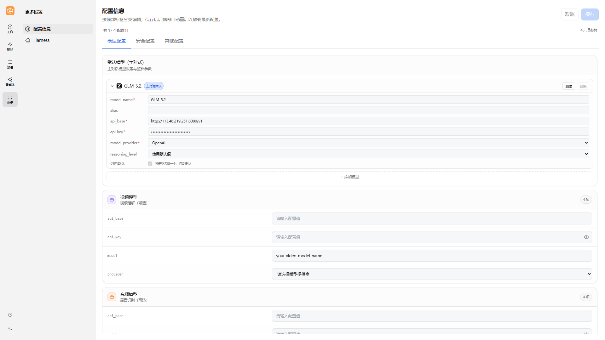
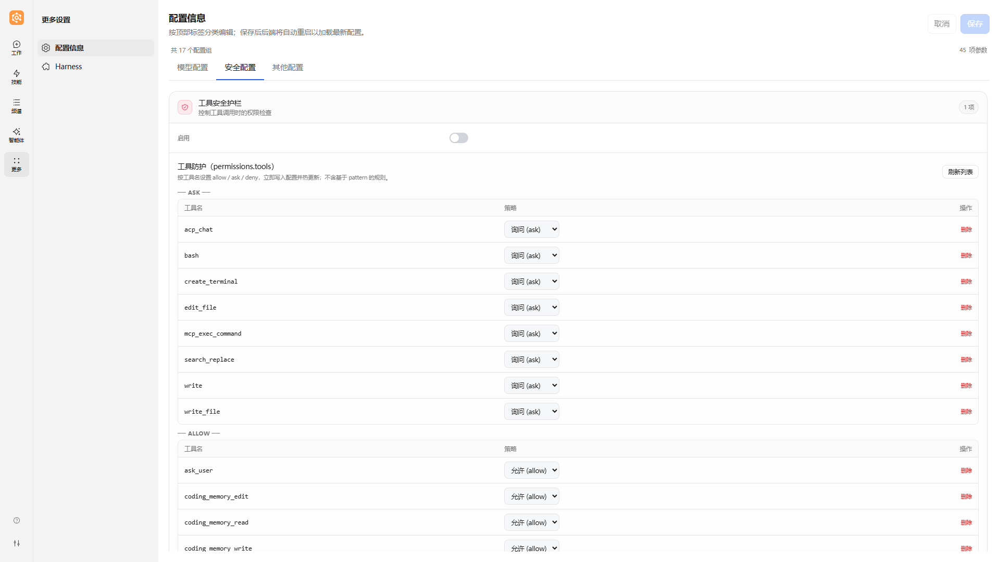

# 配置信息

JiuwenSwarm 的配置信息是您与智能体交互的基础设置。通过合理的配置，您可以连接不同的模型服务、启用多模态能力、配置第三方服务，以及调整系统行为参数。

本文档将详细介绍 JiuwenSwarm 前端配置面板中的各项配置，帮助您快速上手并充分发挥系统能力。

---

## 一、配置入口

在左侧导航栏点击「**更多**」→「**配置信息**」，即可在网页上查看和修改与模型、第三方服务、免费搜索等相关的设置。修改后请点击保存；是否需等待服务就绪，以您使用的部署方式为准。



配置面板按标签页分为三个区域：

- **模型配置**：默认对话模型、视频/音频/视觉模型、Embed 配置等（详见 [二、模型配置](#二模型配置)）
- **安全配置**：工具安全护栏、敏感信息过滤等（详见 [七、工具安全护栏](#七工具安全护栏)）
- **其他配置**：第三方服务、自演进配置、上下文压缩、技能交响乐等

> 💡 **提示**：模型配置（`api_base`、`api_key`、`model`、`model_provider`）为必填项，其他配置均为可选。

---

## 二、模型配置

> 在使用 JiuwenSwarm 之前，您需要先向模型提供商申请 API 密钥。请访问相应提供商的官网，按照指引申请 API 密钥。

### 2.1 支持配置的模型

JiuwenSwarm 支持配置多种类型的模型，以满足不同场景的需求：

| 模型类型     | 作用                                                   | 能力要求                                                 | 是否必选 |
| ------------ | ------------------------------------------------------ | -------------------------------------------------------- | -------- |
| **默认模型** | 主对话核心模型，处理所有文本对话、任务规划、工具调用等 | 需具备**工具调用（Function Calling）**能力，支持多轮对话 | ✅ 必选   |
| **视频模型** | 视频理解与分析，支持视频内容问答、场景识别等           | 需具备**视频理解**能力，能处理视频输入                   | ⭕ 可选   |
| **音频模型** | 语音识别与处理，支持语音转文字、音频内容分析等         | 需具备**语音识别/音频理解**能力                          | ⭕ 可选   |
| **视觉模型** | 图像理解与分析，支持图像问答、OCR、场景描述等          | 需具备**图像理解**能力，能处理图片输入                   | ⭕ 可选   |
| **图片生成模型** | 根据文本描述生成图片，支持AI绘画、图像创作等        | 需具备**图像生成**能力，能根据文本生成图片               | ⭕ 可选   |

> 💡 **提示**：默认模型是系统运行的基础，必须正确配置。视频、音频、视觉、图片生成模型为可选配置，当您需要相应多模态能力时再配置即可。其中图片生成模型暂不在前端配置面板中展示，需通过主配置（`models.image_gen`）或环境变量（`IMAGE_GEN_API_BASE` 等）配置。

### 2.2 配置项说明

每种模型类型都包含以下配置项：

| 配置项（前端字段） | 后端字段（config.yaml） | 说明              | 备注                                                         |
| ---------------- | --------------------- | ----------------- | ------------------------------------------------------------ |
| `api_base`       | `api_base`            | 模型 API 基础地址 | 填写服务商提供的 API 地址，**无需包含 `/chat/completions` 后缀**，系统会自动补齐 |
| `api_key`        | `api_key`             | 模型 API 密钥     | 从模型服务商官网获取，注意保密                               |
| `model`          | `model_name`          | 模型名称          | 填写具体的模型 ID，如 `gpt-4o`、`claude-3-opus`、`deepseek-chat` 等           |
| `model_provider` | `client_provider`     | 模型提供商类型    | 支持 `OpenAI`、`DeepSeek`、`DashScope`、`SiliconFlow`、`InferenceAffinity`、`OpenRouter`，用于适配不同服务商的 API 格式；视频/音频/视觉模型当前仅支持 `OpenAI` |

> 💡 **字段映射说明**：前端配置面板使用 `model` / `model_provider` 作为展示字段名，保存到 `config.yaml` 时会映射为后端字段 `model_name` / `client_provider`。两者含义一致，仅在配置文件中的命名不同。

> 💡 **测试功能**：配置面板提供了**测试按钮**，填写完模型配置后，可以点击"测试"按钮验证 API 连接是否正常。系统会发送一个简单的测试请求，如果成功会显示"测试成功"，否则会提示错误信息。


#### 配置示例

以 OpenAI 兼容 API 为例：

```
api_base: https://api.openai.com/v1
api_key: sk-your-openai-api-key
model: gpt-4o
model_provider: OpenAI
```

以 DeepSeek 为例：

```
api_base: https://api.deepseek.com/v1
api_key: sk-your-deepseek-api-key
model: deepseek-chat
model_provider: DeepSeek
```

以 SiliconFlow 为例：

```
api_base: https://api.siliconflow.cn/v1
api_key: sk-your-siliconflow-api-key
model: Qwen/Qwen2.5-72B-Instruct
model_provider: SiliconFlow
```

> 💡 **提示**：大多数模型服务商都提供 OpenAI 兼容的 API，您可以根据实际使用的服务商调整 `api_base` 和 `model` 参数。

### 2.3 多模型管理与别名

配置面板的**模型列表**区块支持同时维护多个模型，方便在不同模型间快速切换。

每个模型条目包含以下字段：

| 字段（前端字段） | 后端字段（config.yaml） | 是否必填 | 说明 |
|------|---------|---------|------|
| `model_name` | `model_name` | 必填 | 模型在 API 层的名称（如 `gpt-4o`、`deepseek-chat`） |
| `api_base` | `api_base` | 必填 | 该模型的 API 地址 |
| `api_key` | `api_key` | 必填 | 该模型的 API 密钥 |
| `model_provider` | `client_provider` | 必填 | 提供商（如 `OpenAI`、`DeepSeek`） |
| `reasoning_level` | `reasoning_level` | 选填 | 推理强度，可选 `off` / `low` / `medium` / `high`，留空表示不设置 |
| `temperature` | `temperature` | 选填 | 采样温度，默认 `0.95` |

**`alias` 规则**：
- 留空时存储时自动赋值为 `model_name`；
- 在所有已配置模型中必须全局唯一：不能与其他模型的 `alias` 或 `model_name` 相同；
- 切换模型时（Web 下拉 / CLI `/model <name>`）可用 `alias` 或 `model_name` 作为标识符。

列表首位为默认使用的模型；可在 UI 中拖拽排序或点击"设为默认"调整首位。

### 2.4 多模态模型效果展示

当您配置了视频、音频或视觉模型后，JiuwenSwarm 将自动启用相应的多模态能力。以下是各模型的应用场景示例：

#### 视频模型应用

以 **GLM-4.6V-Flash11** 视频理解 API 为例：

当您向 JiuwenSwarm 发送视频文件并提问时，系统会调用视频模型进行分析：

```
用户：请分析这个视频，告诉我视频中有哪些主要场景？
[发送视频文件：meeting_recording.mp4]

JiuwenSwarm：根据视频分析，该视频包含以下主要场景：
1. 会议室开场介绍（0:00-2:30）
2. 项目进度汇报（2:30-8:15）
3. 问题讨论环节（8:15-12:00）
4. 总结与下一步计划（12:00-15:00）
```


#### 音频模型应用

以 **GLM-ASR-2512** 音频模型为例：

当您发送音频文件时，系统会调用音频模型进行语音识别或分析：

```
用户：请帮我转录这段录音的内容
[发送音频文件：voice_message.m4a]

JiuwenSwarm：转录结果如下：
"明天下午三点在会议室B开项目评审会，请各位提前准备好相关材料..."
```


#### 视觉模型应用

以 **GLM-4.6V-Flash11** 视觉模型为例：

当您发送图片并提问时，系统会调用视觉模型进行图像理解：

```
用户：这张图片中的表格数据是什么？
[发送图片：data_chart.png]

JiuwenSwarm：根据图像分析，这是一个销售数据统计表：
- 一月销售额：120万
- 二月销售额：135万
- 三月销售额：148万
整体呈上升趋势...
```


---

## 三、Embed 配置

Embed（嵌入）模型用于将文本转换为向量表示，是 JiuwenSwarm 记忆系统实现语义检索的核心组件。

### 3.1 作用说明

Embed 模型的主要作用：

- **语义检索**：将记忆内容转换为向量，支持基于语义相似度的检索，而非简单的关键词匹配
- **记忆召回**：当您询问历史信息时，系统能更准确地找到相关记忆
- **混合检索**：与 BM25 全文检索结合，提供最佳的召回效果

> 💡 **提示**：Embed 配置为可选。若不配置，系统将使用 Mock Provider 进行基础检索。配置后可获得更精准的语义搜索能力。关于记忆系统的详细内容，请参考 [记忆](记忆.md) 文档。

> 💡 **前端字段与环境变量**：下表中的前端配置项保存后会写入 `config.yaml` 的 `embed` 段；若未通过前端配置，也可用环境变量注入，环境变量优先级高于配置文件。对应关系：`embed_api_key` ↔ `EMBED_API_KEY`、`embed_api_base` ↔ `EMBED_API_BASE`（写入 config.yaml 时字段名为 `embed_base_url`）、`embed_model` ↔ `EMBED_MODEL`。

### 3.2 配置项说明

| 配置项（前端字段） | 后端字段（config.yaml） | 说明                    | 参考格式                        | 备注                          |
| ---------------- | --------------------- | ----------------------- | ------------------------------- | ----------------------------- |
| `embed_api_base` | `embed_base_url`      | Embed 服务 API 基础地址 | `https://api.siliconflow.cn/v1` | 填写 Embed 服务商的 API 地址  |
| `embed_api_key`  | `embed_api_key`       | Embed 服务 API 密钥     | `sk-xxxxxxxxxxxxxxxx`           | 从服务商官网获取              |
| `embed_model`    | `embed_model`         | Embed 模型名称          | `BAAI/xxx`        | 建议使用支持中文的 Embed 模型 |


---

## 四、第三方服务配置

第三方服务配置用于启用 JiuwenSwarm 的各种外部能力，包括网页搜索、知识检索、代码仓库访问等。以下配置项均在 **配置信息** 面板中展示（均为可选）。

| 配置项 | 说明 | 参考 |
| --- | --- | --- |
| `jina_api_key` | Jina；网页抓取及部分搜索能力 | [Jina](https://jina.ai/) |
| `bocha_api_key` | 博查 Bocha Web Search | [博查开放平台](https://open.bochaai.com/) |
| `serper_api_key` | Serper 搜索 | [Serper](https://serper.dev/) |
| `perplexity_api_key` | Perplexity | [Perplexity](https://www.perplexity.ai/) |
| `github_token` | GitHub；SkillNet 等 | [GitHub Tokens](https://github.com/settings/tokens) |
| `teamskills_user_token` | TeamSkillsHub 用户 Token | [TeamSkillsHub](https://teamskills.openjiuwen.com) |

> ⚠️ **注意**：均为可选。不填写时，对应能力可能不可用或走降级策略，以实际产品行为为准。

> 💡 **TeamSkillsHub Token 说明**：`teamskills_user_token` 用于在 `/swarmskills search`、`/swarmskills install` 等命令中标识您的 TeamSkillsHub 账户身份，便于技能的安装记录、版本追踪与权限校验。不配置时，仍可浏览和搜索公开技能，但安装 / 同步私有技能、记录安装历史等功能将受限。配置方式：在 [TeamSkillsHub](https://teamskills.openjiuwen.com) 登录后于个人中心生成 Token，填入配置面板即可。

此外还有两类相关配置：

- **免费搜索引擎配置**：`free_search_ddg_enabled`（DuckDuckGo）、`free_search_bing_enabled`（Bing）两个开关，控制免费搜索引擎的启用。
- **TeamSkillsHub 其他配置**：`teamskills_market_url`（市场地址）、`teamskills_system_token`（系统 Token）、`teamskills_allowed_download_hosts`（允许下载的主机列表），按需配置。

---

## 五、自演进配置

自演进配置控制 JiuwenSwarm 的 Skills 自动改进能力。



### 开关说明

前端在 **自演进配置** 中展示以下开关：

| 开关 | 对应配置 | 默认值 | 作用 |
| --- | --- | --- | --- |
| **启用 Skills 自演进** | `react.evolution.skill_evolution` | `false` | 统一控制自动技能创建与技能演进。关闭后相关 Rails、工具、提示词、watcher 和 `/evolve` 指令均不可用 |

> 💡 **说明**：`react.evolution.auto_save` 是仅保留在 YAML 中的高级审批设置，前端不展示。用户显式使用通用 `skill-creator` 或 `swarmskill-creator` 能力不受该自动自演进开关影响。

> 📖 **详情**：关于自演进机制的详细说明，请参考 [Skill 自演进](Skill自演进.md) 文档。

---

## 六、上下文压缩

上下文压缩配置控制对话历史的管理策略。


### 开关说明

- **配置项**：`react.context_engine_config.enabled`
- **默认值**：`true`（开启）
- **作用**：启用后，当对话内容超出上下文窗口限制时，系统会自动压缩和卸载部分内容，保持对话流畅

该区域还提供 **算力亲和（KV 释放）** 开关（配置项 `react.context_engine_config.enable_kv_cache_release`，默认 `false`）。

当开启上下文压缩后，系统会：

1. 监控对话消息数量和 Token 数量
2. 当超出阈值时，自动识别并归档"大而次要"的内容
3. 保留简要索引，为当前任务腾出空间

### 算力亲和（KV 释放）

**算力亲和（KV 释放）** 是上下文压缩的高级优化功能，用于管理 GPU 显存使用。

- **配置项**：`react.context_engine_config.enable_kv_cache_release`
- **默认值**：`false`（关闭）
- **作用**：启用后，系统会在对话过程中动态释放不再需要的 KV Cache（键值缓存），以节省 GPU 显存空间，允许处理更长的对话上下文

**KV Cache 说明**：
- KV Cache 是大语言模型推理时用于存储中间计算结果的缓存
- 随着对话轮次增加，KV Cache 会持续增长，占用大量显存
- 启用 KV 释放后，系统会智能判断并释放历史对话中不再需要的缓存数据

**适用场景**：
- 长时间对话场景，需要保持大量历史记录
- GPU 显存有限的环境
- 需要处理超长上下文的任务

> 📖 **详情**：关于上下文压缩机制的详细说明，请参考 [上下文压缩](上下文压缩.md) 文档。

---

## 七、工具安全护栏

工具安全护栏配置控制工具调用时的权限检查机制。


### 开关说明

- **配置项**：`permissions.enabled`
- **默认值**：`false`（关闭）
- **作用**：启用后，系统会在执行敏感工具操作前进行权限检查，根据配置策略决定是否需要用户确认

当开启工具安全护栏后，系统会：

1. 检查每个工具调用的权限配置
2. 根据规则判断行为：`allow`（直接执行）、`ask`（询问用户）、`deny`（拒绝执行）
3. 对于 `ask` 类操作，会弹出确认框让用户决定

### 权限规则示例

```yaml
permissions:
  enabled: true
  schema: tiered_policy
  permission_mode: normal  # normal | strict，决定 severity 到动作的映射
  defaults:
    "*": "allow"           # 默认允许所有操作
  tools:
    bash: ask              # 命令执行默认需确认
    mcp_exec_command: ask
    write_file: ask
  rules:
    - id: shell_allow_ls
      tools: [bash, mcp_exec_command, create_terminal]
      pattern: "ls *"
      severity: LOW        # normal 模式下 LOW/MEDIUM → allow
    - id: shell_ask_rm
      tools: [bash, mcp_exec_command, create_terminal]
      pattern: "rm *"
      severity: HIGH       # normal 模式下 HIGH/CRITICAL → ask
```

---

## 八、记忆系统敏感信息过滤

记忆系统敏感信息过滤配置用于保护用户隐私，防止敏感信息被写入记忆系统。

### 开关说明

- **配置项**：`memory.forbidden_memory_definition.enabled`
- **默认值**：`false`（关闭）
- **作用**：启用后，系统会在写入记忆前按 `memory.forbidden_memory_definition.patterns` 自动检测并过滤敏感信息

> 💡 **说明**：该开关默认关闭，需要手动开启。开启后系统会按 `forbidden_memory_definition.patterns` 中的规则匹配敏感信息；`description` 字段用于记录过滤策略的说明文字（中英文）。

### 过滤内容类型

系统会自动识别并过滤以下类型的敏感信息：

| 类型 | 说明 | 示例 |
| --- | --- | --- |
| **个人身份信息** | 姓名、身份证号、手机号等 | 张三、110101199001011234 |
| **银行账户信息** | 银行卡号、支付宝/微信账号 | 622202******1234 |
| **地址信息** | 详细住址、公司地址等 | 北京市朝阳区xxx街道xxx号 |
| **邮箱地址** | 个人或工作邮箱 | xxx@example.com |
| **密码/密钥** | 各类密码、API密钥等 | password123、sk-xxxx |

> 📖 **详情**：关于记忆系统的详细说明，请参考 [记忆](记忆.md) 文档。

---

## 九、技能交响乐与技能检索配置

技能交响乐（Symphony）相关配置用于控制两类能力：**技能检索**负责从已安装技能中找到候选技能，**技能编排**负责基于技能总谱把候选技能组织成可确认、可执行的技能链。

### 9.1 前端开关

配置面板中主要有两个相关开关：

| 开关 | 对应配置 | 默认值 | 作用 |
| --- | --- | --- | --- |
| **启用技能检索** | `symphony.skill_retrieval.enabled` | `false` | 注册 `skill_branch_explore`、`skill_branch_peek`、`skill_index_build` 等技能树检索工具 |
| **启用技能交响乐** | `symphony.enabled` | `false` | 注册 `symphony_read_graph`、`symphony_refresh_graph`、`symphony_compose_graph` 等技能总谱与编排工具 |

两个开关相互独立：技能检索解决“怎么找到候选技能”，技能交响乐解决“怎么把候选技能编排成路线”。如果只开启技能检索，系统只会获得技能树检索能力；如果只开启技能交响乐，系统可以读取和刷新技能总谱，但候选技能范围不会自动来自技能树检索。

### 9.2 技能索引与技能总谱

相关页面位于左侧导航栏 **技能** 下：

| 页面 | 作用 |
| --- | --- |
| **技能索引** | 构建本地已安装技能树索引，用于运行时按目录逐层检索候选技能 |
| **技能总谱** | 构建和查看技能之间的可衔接关系，用于技能编排 |

安装、卸载或大量修改技能后，建议先重新构建技能索引；如果技能变化会影响技能之间的衔接关系，还需要在技能总谱页执行增量构建或全量重新构建。

### 9.3 主配置中的 Symphony 参数

更细的构建、检索和编排参数在用户运行时配置文件中配置：

```text
~/.jiuwenswarm/config/config.yaml
```

常用配置项如下：

保留的 `symphony.fingerprint.scan` 和 `symphony.fingerprint.extraction`
配置由 JiuwenSwarm Adapter 映射到 agent-core 的 `SkillFolderScanner` 和
`FingerprintService` 配置。

| 配置项 | 默认值 | 说明 |
| --- | --- | --- |
| `symphony.paths.skills_root` | 空字符串 | 技能来源目录；为空时使用运行时默认目录 |
| `symphony.paths.graph_dir` | 空字符串 | 技能总谱产物目录；为空时使用运行时默认目录 |
| `symphony.fingerprint.scan.max_depth` | 空 | 映射到 agent-core `SkillFolderScanner` 的技能文件扫描最大深度；为空时使用运行时默认值 |
| `symphony.fingerprint.extraction.workers` | `4` | 映射到 agent-core `FingerprintService` 的指纹抽取并发数 |
| `symphony.fingerprint.extraction.batch_size` | `2` | 映射到 agent-core `FingerprintService` 的指纹抽取批大小 |
| `symphony.fingerprint.extraction.body_limit` | 空 | 映射到 agent-core `FingerprintService` 的正文长度限制；为空时使用运行时默认值 |
| `symphony.build.workers` | `4` | 技能总谱构建并发数 |
| `symphony.build.batch_size` | `16` | 技能总谱构建批大小 |
| `symphony.build.require_consensus` | `false` | 是否要求多个判断达成一致后再接受关系 |
| `symphony.build.min_edge_confidence` | `0.1` | 写入技能总谱的最低边置信度 |
| `symphony.orchestration.mode` | `fast` | 编排模式，当前运行时使用快速编排路径 |
| `symphony.orchestration.max_depth` | `4` | 技能链最大搜索深度 |
| `symphony.orchestration.min_edge_confidence` | `0.3` | 编排优先使用的技能总谱边最低置信度 |
| `symphony.skill_retrieval.artifact_root` | 空字符串 | 技能索引产物目录；为空时使用默认工作区，可由 `SYMPHONY_SKILL_RETRIEVAL_ROOT` 提供 |
| `symphony.skill_retrieval.build.branching_factor` | `128` | 技能树拆分阈值基数，影响树的粗细 |
| `symphony.skill_retrieval.build.max_depth` | `6` | 技能树最大深度 |
| `symphony.skill_retrieval.build.root_categories` | 空字符串 | 技能树根分类配置，可用于稳定第一层目录 |
| `symphony.skill_retrieval.build.max_workers` | `2` | 技能索引构建并发数 |
| `symphony.skill_retrieval.build.max_retries` | `2` | LLM 分类或分组失败后的重试次数 |
| `symphony.skill_retrieval.build.request_timeout_seconds` | `420` | 单次 LLM 构建请求超时时间 |
| `symphony.skill_retrieval.build.classification_batch_limit` | `32` | 单次分类调用最多放入多少个技能 |
| `symphony.skill_retrieval.build.discovery_seed` | `42` | 构建采样随机种子，用于提高可复现性 |
| `symphony.skill_retrieval.build.postprocess_enabled` | `true` | 构建后是否清理不清晰或过小的分支 |
| `symphony.skill_retrieval.build.postprocess_max_passes` | `1` | 构建后处理最多执行轮数 |
| `symphony.skill_retrieval.build.postprocess_min_skills` | `6` | 构建后处理时保留分支的最小技能数参考值 |
| `symphony.skill_retrieval.build.equivalence_enabled` | `false` | 是否启用语义重复分支合并 |
| `symphony.skill_retrieval.retrieve.compact_codes_enabled` | `false` | 检索时是否使用更紧凑的节点编码 |
| `symphony.skill_retrieval.retrieve.flatten_tree` | `false` | 检索时是否扁平化技能树 |
| `symphony.skill_retrieval.retrieve.max_exposure_depth` | `1` | 单次 `skill_branch_explore` 最多披露的树深度 |

> 📖 **详情**：关于技能检索、技能总谱和技能编排的完整说明，请参考 [Symphony：技能检索、编排与分发](symphony-技能编排与分发.md)。

---

## 十、高级配置

除 **配置信息** 页中的表单项外，产品还可通过**主配置**调整超时、温度、心跳间隔、上下文窗口阈值等（与界面中的「上下文压缩」「权限」「记忆禁忌」等开关配合使用）。主配置文件通常位于：

```
~/.jiuwenswarm/config/config.yaml
```

（具体路径以部署环境为准；容器化部署时一般在挂载的配置卷内）。**本文不列出这些项的详细字段**；若您需要离线修改或批量下发，请咨询部署方或管理员。

### 10.1 主配置中常见的逻辑项（概念名）

下列为**主配置**里常见的逻辑路径名称，仅供与运维文档或发行说明对照；**不是**「配置信息」页上的每一个字段。

| 配置项（概念路径） | 说明 | 默认值（常见） |
| --- | --- | --- |
| `preferred_language` | 界面语言 | `zh` |
| `models.*.model_client_config.timeout` | 模型请求超时（秒） | `1800` |
| `models.*.model_client_config.verify_ssl` | 是否校验 SSL | `false` |
| `models.*.model_config_obj.temperature` | 温度 | `0.95` |
| `heartbeat.every` | 心跳间隔（秒） | `3600` |
| `react.context_engine_config.dialogue_compressor_config.tokens_threshold` | 历史对话压缩 Token 阈值 | `100000` |
| `react.context_engine_config.round_level_compressor_config.trigger_context_ratio` | 轮次级压缩触发比例（相对有效上下文预算） | `0.9` |

<a id="dotenv-configuration"></a>

### 10.2 与界面以外的运行参数

浏览器自动化、网络代理、部分搜索链路的细粒度开关等，可能由**运行环境或部署模板**提供，**不一定**出现在 **配置信息** 页。普通用户只需完成界面上的必填项与业务相关密钥即可；其余由管理员或运维处理。

### 10.3 配置生效的优先顺序（概念）

从高到低一般为：**您在 Web「配置信息」中保存的设置** → **运行环境注入的变量** → **产品内置默认**。具体行为以您使用的版本与部署方式为准。

> 💡 **提示**：保存后若短时间内未生效，可稍候重试或联系管理员确认服务是否已重载。

---

## 常见问题

### Q: 配置保存后没有生效？

A: 配置保存后系统会自动热更新（必要时才会安排进程重启），请等待几秒钟后再试。如果仍未生效，请检查配置格式是否正确。

### Q: 如何查看当前使用的模型？

A: 在配置面板中可以看到当前配置的模型信息。也可以通过系统日志查看实际调用的模型。

### Q: 多模态模型必须配置吗？

A: 不必须。视频、音频、视觉模型都是可选的。只有当您需要使用相应的多模态功能时才需要配置。

### Q: 模型配置里的 `api_base` 需要带 `/chat/completions` 后缀吗？

A: 不需要。`api_base` 只填到版本号层级即可（如 `https://api.openai.com/v1`），系统会自动补齐 `/chat/completions`。如果手动补上后缀，可能导致请求路径重复而报错。配置完成后可点击「测试」按钮验证连通性。

### Q: 多模型列表中 `alias` 提示冲突怎么办？

A: `alias` 在所有已配置模型中必须全局唯一，且不能与其他模型的 `alias` 或 `model_name` 重复。留空时系统会自动赋值为 `model_name`。出现冲突时，请手动为重复的模型指定不同的 `alias`；切换模型时（Web 下拉或 `/model <name>`）可以用 `alias` 或 `model_name` 作为标识符。

### Q: Embed 配置不填写会有影响吗？

A: 不会有致命影响。Embed 为可选配置，不填写时系统会使用 Mock Provider 进行基础检索；配置后可获得更精准的语义搜索能力，记忆系统的召回效果会更好。建议使用支持中文的 Embed 模型。

### Q: 工具安全护栏默认是开启的吗？

A: 不是。工具安全护栏对应配置项 `permissions.enabled`，默认为 `false`（关闭）。开启后，系统会在执行敏感工具操作（如 `bash`、`write_file`）前按权限规则判断是 `allow`/`ask`/`deny`，并在 `ask` 时弹出确认框由用户决定。

### Q: 直接修改 `~/.jiuwenswarm/config/config.yaml` 后如何让它生效？

A: 保存后系统会自动检测并热重载（大部分配置项即时生效，少数需要进程重启）。如果长时间未生效，请检查 YAML 格式是否正确，或通过 Web 配置面板重新保存一次触发刷新。

---
