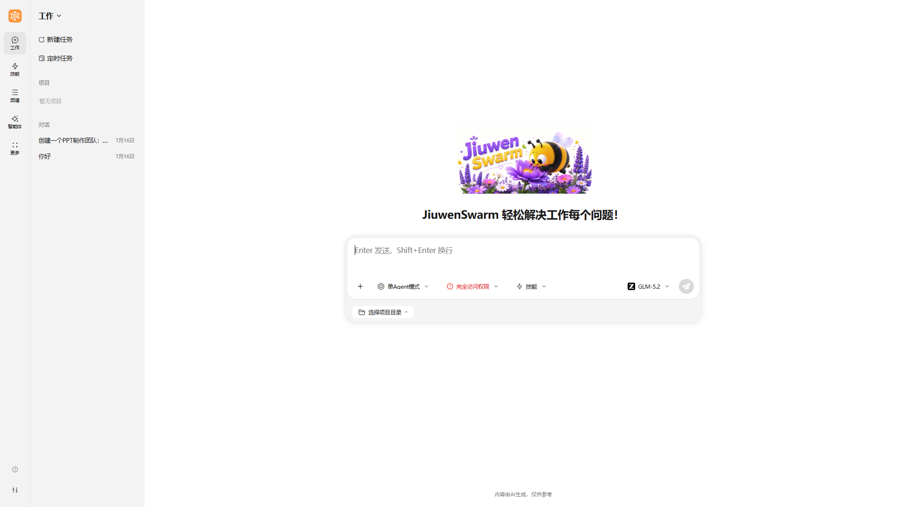
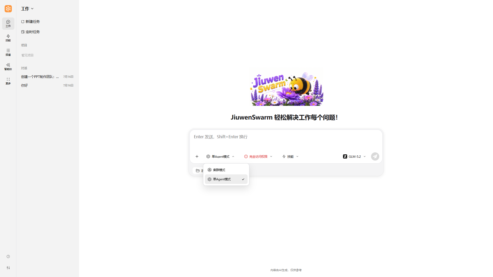

# JiuwenSwarm 页面概览

> **目标**：帮助读者全面了解 JiuwenSwarm 网页端的页面结构、功能布局和交互方式，为后续深入使用打下基础。
>
> **英文版：** [Page-Overview（English）](../en/Page-Overview.md)

---

## 整体布局

JiuwenSwarm 网页端采用两栏布局，左侧为图标导航栏，右侧为主工作区，设计简洁高效。

### 布局概览

| 区域 | 位置 | 主要功能 |
|------|------|----------|
| 左侧导航栏 | 页面左侧 | 图标式功能菜单入口、新建对话、设置 |
| 中间主工作区 | 页面中央及右侧 | 对话交互、任务执行、功能管理 |

### 布局特点

1. **图标导航栏**：左侧采用紧凑的图标式导航，节省空间
2. **信息集中**：核心交互功能和辅助信息均集中在主工作区
3. **响应式设计**：页面会根据屏幕宽度自动调整

> 💡 **提示**：建议在宽屏显示器（1920×1080 或更高）上使用，以获得最佳体验。

---

## 左侧导航栏

左侧导航栏是 JiuwenSwarm 的功能入口中心，采用图标式设计，包含主要功能的访问入口。

### 功能菜单

导航栏分为三个区域：**主导航**、**更多菜单**、**底部按钮**。

**主导航**（直接显示在导航栏中）：

| 功能 | 说明 | 使用场景 |
|------|------|----------|
| **工作** | 对话交互与任务执行的主入口，包含会话管理、定时任务、项目管理 | 日常问答、任务执行、代码生成等 |
| **技能** | 技能库管理，包含查看、安装、配置各种扩展技能 | 需要启用额外功能（如深度搜索、PPT生成等）时 |
| **频道** | 频道配置，包含管理消息推送渠道（飞书、微信、Telegram 等） | 需要通过不同平台接收 AI 消息时 |
| **智能体** | 查看智能体工作区文件与记忆内容 | 查看工作区文件、了解智能体运行状态时 |
| **更多** | 展开更多设置面板，包含配置信息、Harness 等 | 需要调整系统配置或管理扩展包时 |

**更多菜单**（点击"更多"后展开）：

| 功能 | 说明 | 使用场景 |
|------|------|----------|
| **配置信息** | 系统配置，按标签页分类：模型配置、安全配置、其他配置 | 需要调整系统行为或切换底层模型时 |
| **Harness** | Harness Package 管理，包含导入/导出扩展包 | 需要管理 Agent 扩展能力时 |

**底部按钮**：

| 按钮 | 说明 |
|------|------|
| **配置指引** | 引导用户完成初始配置（如模型设置） |
| **更多设置** | 展开高级设置面板，包含连接状态、版本号、语言切换 |

### 版本信息与设置

- **位置**：点击导航栏**左下角**的设置按钮（齿轮图标）
- **显示内容**：连接状态、当前 JiuwenSwarm 版本号、语言切换（中/En）
- **作用**：便于确认系统版本、切换界面语言、查看连接状态

---

## 中间主工作区

中间主工作区是用户与 JiuwenSwarm 进行交互的核心区域，大部分操作都在这里完成。根据左侧导航栏选择的功能不同，主工作区会显示对应的功能页面。

### 1. 工作页面（对话与任务）

工作页面是主要的人机交互界面，用于与 JiuwenSwarm 进行对话和任务执行。

**页面结构**：

- **左侧子面板**：包含会话列表、定时任务入口、项目管理
- **右侧主区域**：对话交互区，包含对话历史和输入区域

**输入区域控件**：

输入区域提供 5 个快捷控件：

| 控件 | 说明 |
|------|------|
| **添加图片** | 上传图片文件供智能体分析 |
| **模式选择器** | 选择执行模式：单Agent模式 / 集群模式 |
| **权限选择器** | 选择工具权限：默认权限 / 完全访问权限 |
| **技能选择器** | 选择要加载的技能 |
| **模型选择器** | 选择当前对话使用的模型 |

### 2. 执行模式

JiuwenSwarm 支持两种执行模式，用户可根据任务特点选择：

| 模式 | 运行方式 | 适用场景 |
|------|----------|----------|
| **单Agent模式** | 单个智能体独立处理任务，支持任务规划与动态调整 | 大多数日常任务、问答、代码生成等 |
| **集群模式** | 多智能体协作模式，由 Leader 编排多个专业智能体分工协作，各智能体并行处理各自负责的子任务，最终由 Leader 统一汇总输出 | 大型复杂任务、需要多角色协作的场景（如生成 PPT、深度研究报告等） |

> **与「配置信息」的边界**：模式仅在**页面内**用模式选择器切换；本文**不**说明需改配置文件、环境变量等后台改法，避免与 [配置信息](配置信息.md) 混淆。

**模式切换**：

- 在**对话输入区域**点击模式选择器切换执行模式；
- 不同模式会改变智能体的规划与执行方式；在「集群模式」下，你通常能看到智能体**分工协作、并行处理**的过程（以 UI 实际展示为准）。

### 3. 任务控制栏

在任务**运行过程中**，通常可在同一区域对**当前任务**做**手动**控制：

| 状态 | 说明 | 用户可执行操作（概括） |
|------|------|------------------------|
| **处理中** | 系统正在响应当前输入 | 等待结束；可点击 **停止** 按钮终止当前执行 |
| **已停止** | 已停止，不再继续同一条用户指令下的执行 | 可发起新的用户输入 |

> 💡 **提示**：在集群模式下，点击停止按钮会暂停当前执行，可恢复继续。

---

## 常见问题

**Q: 页面加载缓慢怎么办？**
A: 检查网络连接，清除浏览器缓存，或尝试刷新页面。

**Q: 连接状态显示"断开"怎么办？**
A: 检查后端服务是否运行，确认网络连接正常。

---

> **下一步**：熟悉页面布局后，建议阅读 [快速开始](Quickstart.md) 与 [技能系统](技能.md) 深入了解各项功能（[English: Quick start](../en/Quickstart.md)、[Skills](../en/Skills.md)）。
